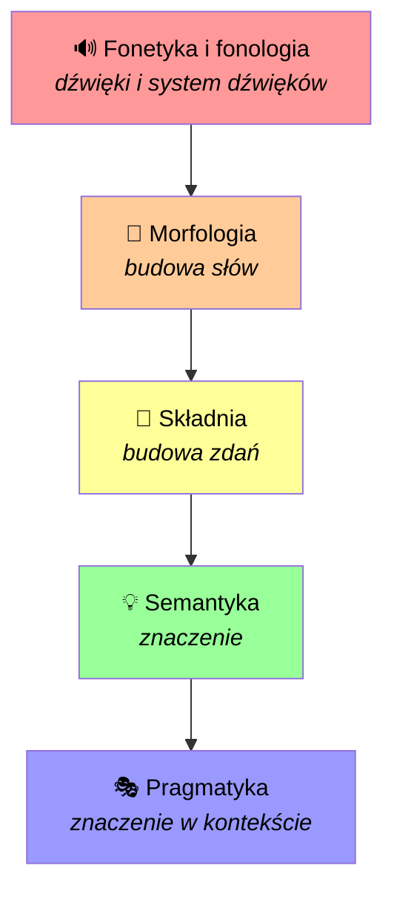
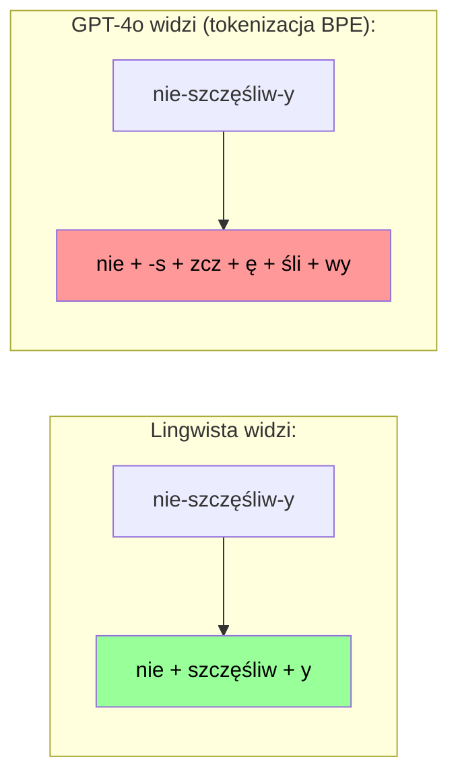
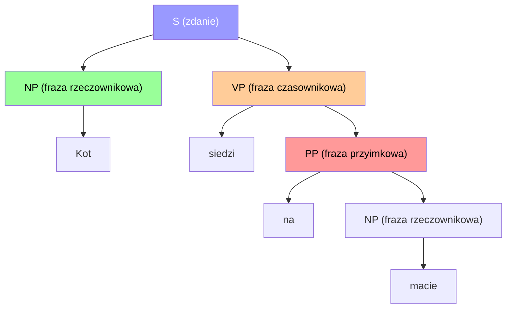
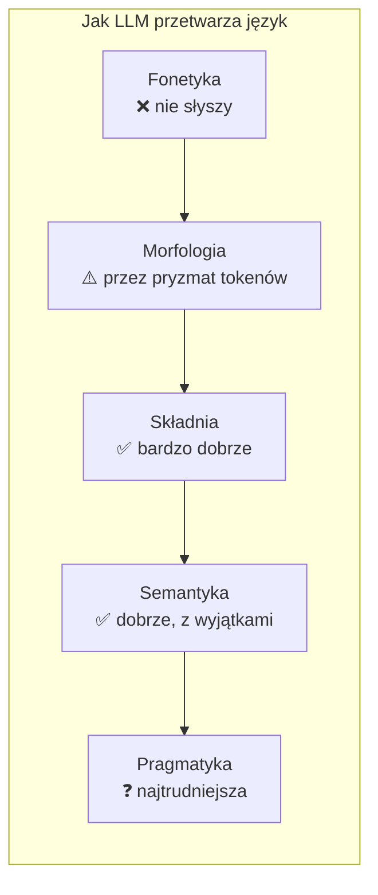

# Cechy językowe - co musisz wiedzieć, zanim zrozumiesz, jak myśli LLM

LLM (Large Language Models, czyli takie ChatGPT, Claude, Gemini i spółka) jest już z nami od jakiegoś czasu i stwierdziłem, że zacznę głębiej wchodzić w ten temat i pojawiło się jedno wielkie pytanie: **ale jak to w ogóle działa, że model "rozumie" język?** Bo przecież pod spodem to tylko "matematyka i statystyka", prawda? No... tak i nie ;-)

I wtedy wpadłem na lingwistykę. I okazało się, że żeby naprawdę zrozumieć, co LLM robi z językiem, trzeba najpierw zrozumieć, z czego ten język się składa. A że programista próbujący czytać o lingwistyce to dość zabawny obrazek, to pomyślałem: **podzielę się tym z wami** ;-)

To jest **pierwszy wpis z serii**, w której będziemy przeglądać różne poziomy analizy języka i patrzeć, jak to wszystko łączy się z LLM. W dzisiejszym wpisie zbudujemy fundament - poznamy pięć głównych warstw języka i zobaczymy, dlaczego każda z nich jest ważna dla modeli językowych.

---

## Język jak cebulka - warstwa na warstwie

Zanim wejdziemy w szczegóły, wyobraźcie sobie język jako taką... cebulę. Albo tort warstwowy, jeśli wolicie słodkie metafory :D

Każda warstwa to inny poziom, na którym język "działa". Od najniższej - dźwięków - do najwyższej - tego, co *naprawdę* chcieliśmy powiedzieć, nawet jeśli powiedzieliśmy coś zupełnie innego.



Pięć warstw, pięć sposobów, na jakie język jest "analizowany". I uwaga - **LLM musi sobie z każdym z tych poziomów radzić**, żeby wydawać się sensownym rozmówcą. Oczywiście nie robi tego świadomie - ale struktury, których uczy się w trakcie treningu, jakoś te warstwy "łapią".

> [!NOTE]
> **Pięć warstw języka w pigułce:**
> 1. **Fonetyka i fonologia** - dźwięki i jak są zorganizowane w system
> 2. **Morfologia** - jak słowa są budowane z mniejszych kawałków
> 3. **Składnia** - zasady porządku słów w zdaniu
> 4. **Semantyka** - znaczenie słów i zdań
> 5. **Pragmatyka** - jak kontekst zmienia znaczenie wypowiedzi

OK, przejdźmy do rzeczy. Zaczynamy od dołu naszej cebulki ;-)

---

## Fonetyka i fonologia - dźwięki, których LLM nie słyszy

### Czym jest fonetyka?

**Fonetyka** bada dźwięki mowy jako zjawiska fizyczne. Mówiąc najprościej: jak produkujemy dźwięki, jak one podróżują przez powietrze i jak je odbieramy.

Ma trzy gałęzie:

| Gałąź | Co bada | Przykład |
|---|---|---|
| **Artykulacyjna** | Jak narządy mowy produkują dźwięki | Gdzie jest język, gdy mówisz "sz"? |
| **Akustyczna** | Fizyczne właściwości fal dźwiękowych | Częstotliwość, amplituda |
| **Audytywna** | Jak ucho i mózg odbierają dźwięki | Jak ślimak przetwarza fale na sygnał nerwowy |

### A fonologia?

**Fonologia** to poziom wyżej. Nie interesują jej same dźwięki jako fizyczne zjawiska, ale **jak dźwięki są zorganizowane w konkretnym języku**.

Kluczowe pojęcie: **fonem** - to najmniejsza jednostka dźwiękowa, która odróżnia znaczenie słów.

Prosty przykład po polsku:

- **kot** vs **lot** - słowa różnią się jednym dźwiękiem (/k/ vs /l/), a znaczenie jest zupełnie inne
- **ras** vs **las** - /r/ vs /l/ znowu zmienia wszystko

Albo po angielsku:
- **pat** vs **bat** - /p/ vs /b/ i mamy zupełnie inne słowo

> [!TIP]
> **Eksperyment:** Wymów na głos "kot" raz jako zwykłe zdanie ("Mój kot śpi."), a raz jako pytanie z zaskoczeniem ("Kot?!" z uniesionymi brwami). Ten sam wyraz, ale intonacja, akcent i melodia całkowicie zmieniają to, co "słyszy" odbiorca. To jest właśnie fonologia w działaniu - dźwięki + ich organizacja w system.

### Dlaczego to ważne dla LLM?

No właśnie - **LLM dostaje tekst, nie dźwięk**. Nigdy nie usłyszał wymowy. A mimo to...

- wie, że "kot" i "lot" rymują się (bo widział to w tekstach)
- radzi sobie z kalamburami i grami słowymi opartymi na dźwiękach
- potrafi pisać wiersze z rymami

Czyli model jakoś **przyswaja informacje fonologiczne** z samych danych tekstowych. Trochę jakbyś nigdy nie widział oceanu, ale przeczytał o nim tyle książek, że potrafisz go opisać ;-)

No ale oczywiście są ograniczenia. LLM tekstowy nie rozróżnia homofonów (słów, które brzmią tak samo, ale znaczą co innego) na podstawie fonetyki - radzi sobie z nimi czysto na poziomie semantycznym (o czym za chwilę).

I tu ciekawostka: modele typu **Whisper** (speech-to-text od OpenAI) już łączą fonetykę z tekstem. Ale to temat na osobny wpis w tej serii ;-)

> [!WARNING]
> **Paradoks:** LLM nigdy nie słyszał żadnego dźwięku, ale z danych treningowych "wie" o rymach, grach słownych i wzorcach brzmieniowych. To trochę jak osoba głucha od urodzenia, która potrafi pisać wiersze z rymami - bo przeczytała ich miliony.

---

## Morfologia - jak słowa są budowane z klocków

### Czym jest morfologia?

**Morfologia** bada budowę słów - jak są one składane z mniejszych, sensownych kawałków zwanych **morfemami**.

Morfem to **najmniejsza jednostka języka, która niesie ze sobą znaczenie**. Nie da się jej podzielić na coś jeszcze mniejszego, co miałoby znaczenie.

Przykład z angielskiego, często używany w podręcznikach:

```
unhappiness = un + happy + ness
              ↑       ↑       ↑
           „nie"   „szczęśliwy"  rzeczownik
```

Albo po polsku:

```
nieszczęśliwy = nie + szczęśliw + y
                  ↑        ↑       ↑
              „nie"  „szczęście"   rodzaj męski
```

Albo jeszcze bardziej:

```
nieprzystojny = nie + przy + stoj + ny
```

Każdy z tych kawałków ma swoje znaczenie. To są właśnie morfemy.

### Dwa rodzaje morfemów

| Typ | Opis | Przykłady |
|---|---|---|
| **Wolne** | Mogą stać samodzielnie jako słowo | kot, dom, biegnie |
| **Związane** | Muszą być dołączone do innego morfemu | nie-, -ek, -owie, -ować |

A wśród morfemów związanych mamy **afiksy**:

- **Prefiksy** (przed rdzeniem): *nie-*, *prze-*, *od-*, *naj-*
- **Sufiksy** (za rdzeniem): *-ek*, *-owie*, *-ować*, *-ny*
- **Infiksy** (wewnątrz rdzenia): w polskim praktycznie nie występują, ale w innych językach tak! Np. w tagalskim (Filipiny): *sulat* (pisać) -> *s**um**ulat* (napisać) - morfem *-um-* jest wstawiony w środek rdzenia. Albo pomyślcie o angielskim *abso-bloody-lutely* ;-)

### Fleksja vs słowotwórstwo

To ważne rozróżnienie:

**Fleksja** (odmiana) - zmienia formę gramatyczną, ale nie tworzy nowego słowa:
- dom -> dom**y** (liczba mnoga)
- biegnie -> bieg**ł** (czas przeszły)

**Słowotwórstwo** (derywacja) - tworzy nowe słowo, często zmieniając część mowy:
- uczyć -> **uczeń** (czasownik -> rzeczownik)
- dom -> **domowy** (rzeczownik -> przymiotnik)

> [!WARNING]
> **Polska morfologia to koszmar dla LLM!** Język polski jest silnie fleksyjny - mamy 7 przypadków, 2 liczby, 3 rodzaje, aspekty czasowników, i mnóstwo wyjątków. Dla porównania: w angielskim odmiana rzeczownika to max. dodanie *-s*. W polskim? "Dom, domu, domowi, dom, domem, domu, domie, domy, domów..." i tak dalej :D

### Jak LLM radzi sobie z morfologią?

Tu jest ciekawostka. LLM nie "wie" czym są morfemy. Używa **tokenizacji BPE** (Byte Pair Encoding), która dzieli tekst na tokeny - ale tokeny to **nie to samo** co morfemy.



Tokenizator BPE dzieli tekst na podstawie **częstotliwości występowania** w danych treningowych, a nie na podstawie struktury językowej. Czasem to się pokrywa z morfemami, a czasem nie.

To znaczy, że model nie uczy się morfologii "od strony" - on uczy się jej pośrednio, przez statystykę. I jakoś mu to działa ;-)

> [!TIP]
> **Zabawa dla was:** Potraficie rozbić te słowa na morfemy?
> - *nieprawdopodobny*
> - *najpiękniejszy*
> - *przeczytaliśmy*

---

## Składnia - zasady gry w układanie zdań

### Czym jest składnia?

**Składnia** to zbiór reguł, które określają, jak słowa są łączone w zdania. To dzięki składni wiemy, że "Kot siedzi na macie" to poprawne zdanie, a "Kot macie na siedzi" to bełkot.

Proste? No... bardziej albo mniej ;-)

### Szyk zdania

W różnych językach obowiązują różne zasady porządku słów:

| Język | Podstawowy szyk | Przykład |
|---|---|---|
| Angielski | SVO (Subject-Verb-Object) | The cat sits on the mat |
| Polski | "Elastyczny" SVO, ale... | Kot siedzi na macie / Na macie siedzi kot / Siedzi kot na macie |
| Japoński | SOV | 猫がマットの上に座っている |
| Łacina | Wolny (bo końcówki mówią wszystko) | Felix in tapete sedet |

Polski jest fajny, bo mamy dość dużą swobodę w szyku zdania. O ile w angielskim "On the mat sits the cat" brzmi poetycko albo nienaturalnie, o tyle u nas to normalne zdanie ;-)

### Drzewo składniowe

Zdania mają strukturę hierarchiczną - słowa grupują się w frazy, a frazy w większe frazy. Można to narysować jako drzewo:



To jest proste zdanie "Kot siedzi na macie" i już ma swoją hierarchię! A wyobraźcie sobie zdania z podrzędnymi, imiesłowami, okolicznikami...

### "Bezbarwne zielone idee śpią zaciekawione"

To słynny przykład Noama Chomsky'ego (w oryginale: *"Colorless green ideas sleep furiously"*).

Zdanie jest **składniowo poprawne** - ma podmiot, orzeczenie, prawidłową strukturę. Ale **semantycznie** to kompletny absurd - idee nie mogą być zielone ani spać.

I to jest właśnie dowód na to, że **składnia i semantyka to dwa różne poziomy**. Można mieć perfekt składnię i zero sensu ;-)

> [!IMPORTANT]
> **Składnia to supermoc LLM.** Model uczy się przewidywać następny token na podstawie ogromnej ilości danych tekstowych. W trakcie tego procesu przyswaja wzorce składniowe - wie, że po "Kot siedzi na..." spodziewamy się rzeczownika, a po "Szybko..." czasownika. To jest fundament tego, dlaczego LLM generuje poprawne gramatycznie zdania.

### Quiz: poprawne czy nie?

Sprawdźcie się - które zdania są składniowo poprawne?[^1]

1. Pies szczeka na listonosza.
2. Na listonosza szczeka pies.
3. Szczeka pies na listonosza.
4. Pies listonosza na szczeka.
5. Czy pies szczeka na listonosza?

---

## Semantyka - co to w ogóle znaczy, "znaczenie"?

### Czym jest semantyka?

Jeśli składnia pyta "jak to jest zbudowane?", to semantyka pyta: **"co to znaczy?"**

Semantyka bada znaczenie słów, fraz i zdań. I od razu się okazuje, że to wcale nie jest takie proste.

### Wieloznaczność - jedno słowo, wiele znaczeń

Klasyczny polski przykład: **zamek**

- Zamek - budowla ("Zamek Królewski w Warszawie")
- Zamek - do drzwi ("Zepsuł mi się zamek w drzwiach")
- Zamek - do ubrania ("Rozpiął zamek w kurtce")
- Zamek - w karabinie ("Zamek w karabinie się zaciął")

To samo słowo, cztery zupełnie różne znaczenia. Jak LLM wie, o który chodzi? **Z kontekstu.** I to jest właśnie to, co robi dobrze - bo widział miliony zdań, gdzie "zamek" występował w różnych kontekstach.

Albo inny klasyk - wieloznaczność w jednym zdaniu:

> "Moja droga, ta droga jest bardzo droga."

Trzy razy to samo słowo, trzy różne znaczenia: **droga** (zwrócenie się do kogoś), **droga** (ulica/szlak), **droga** (tania -> droga, przymiotnik). Kontekst zmienia wszystko ;-)

### Synonimy - czy "duży", "wielki" i "ogromny" to to samo?

Prawie. Ale nie do końca:

- **Duży dom** - normalny, po prostu spory
- **Wielki dom** - brzmi bardziej oficjalnie/poetycko
- **Ogromny dom** - no, to już jest rezydencja :D

Semantyka bada te subtelne różnice - zarówno **denotację** (dosłowne znaczenie), jak i **konotację** (skojarzenia, nacechowanie emocjonalne).

### Jak LLM "rozumie" znaczenie?

Tu wchodzi koncept **word embeddings** (osadzeń słów). W dużym uproszczeniu: każde słowo jest reprezentowane jako wektor - ciąg liczb - w wielowymiarowej przestrzeni. Słowa o podobnym znaczeniu są "blisko" siebie w tej przestrzeni.

Słynny przykład, który prawdopodobnie widzieliście:

```
wektor("król") - wektor("mężczyzna") + wektor("kobieta") ≈ wektor("królowa")
```

Czyli: model "wie", że relacja między "król" a "mężczyzna" jest analogiczna do relacji między "królowa" a "kobieta". I to z samych danych, nikt go tego nie uczył!

Możemy to nawet pokazać w kodzie. Oto prosty przykład z biblioteką `gensim` w Pythonie:

```python
from gensim.downloader import load

model = load("glove-wiki-gigaword-50")

result = model.most_similar(
    positive=["king", "woman"],
    negative=["man"],
    topn=3
)

print(result)
# [('queen', 0.85), ...]  -- na pierwszym miejscu: queen!
```

> [!TIP]
> **Jeśli chcecie to przetestować sami:** zainstalujcie `gensim` (`pip install gensim`) i odpalcie powyższy kod. Oczywiście potrzebujecie trochę RAM-u - model GloVe nie jest mały. Ale efekt jest naprawdę satysfakcjonujący ;-)

### Kompozycyjność

Jedno z najważniejszych pojęć w semantyce: **znaczenie zdania jest wynikiem znaczeń poszczególnych słów + zasad ich łączenia.**

Czyli: "Czerwony kot siedzi na macie" = [czerwony] + [kot] + [siedzi] + [na] + [macie] + zasady składniowe.

Brzmi banalne, ale to potężna zasada. Dzięki niej potrafimy zrozumieć nieskończoną liczbę zdań, nawet takich, których nigdy wcześniej nie słyszeliśmy. I dzięki niej LLM potrafi generować nowe, niespotykane zdania, które i tak mają sens.

> [!WARNING]
> **Ale uwaga:** "Zrozumiałem, że nie zrozumiałeś, że to nie było zrozumiałe." - każde słowo jest proste, ale zdanie jako całość wymaga przeanalizowania warstwy po warstwie. Kompozycyjność to potężne narzędzie, ale ma swoje granice.

---

## Pragmatyka - co naprawdę miałem na myśli

### Czym jest pragmatyka?

I tak dochodzimy do najciekawszej (według mnie) warstwy. **Pragmatyka** bada to, **jak kontekst wpływa na znaczenie wypowiedzi** - co *naprawdę* chcemy powiedzieć, często mówiąc coś zupełnie innego.

Jeśli semantyka pyta "co to znaczy?", pragmatyka pyta: **"co autor miał na myśli w tej konkretnej sytuacji?"**

### Scenki z życia wzięte

**Scenka 1: "Zimno tu."**

Semantycznie: informacja o temperaturze w pomieszczeniu.  
Pragmatycznie: **"Zamknij okno!"** albo **"Zwiększ ogrzewanie!"** albo **"Daj mi koc."**

Każdy z was zrozumie, że kiedy ktoś mówi "Zimno tu" w momencie, gdy stoi przy otwartym oknie - nie pytasz o stopnie Celsjusza, tylko zamykasz okno.

**Scenka 2: "Mógłbyś podać sól?"**

Semantycznie: pytanie o twoją *zdolność* podania soli.  
Pragmatycznie: **prośba o podanie soli.**

Odpowiedź "Tak, mógłbym" (i nic więcej) jest semantycznie poprawna, ale pragmatycznie... no, jesteś trochę niemiły ;-)

**Scenka 3: Ironia**

> "No gratulacje, znowu to zepsułeś."

Semantycznie: gratulacje.  
Pragmatycznie: **ironia, krytyka, rozczarowanie.**

Czy LLM łapie ironię? Czasem tak, czasem nie. To wciąż otwarty problem badawczy.

### Teoria aktów mowy

Filozof J.L. Austin wymyślił coś genialnego: **wypowiedzi nie tylko opisują rzeczywistość, ale też coś *robią*.**

| Typ aktu mowy | Opis | Przykład |
|---|---|---|
| **Lokucyjny** | Samo wypowiedzenie | Mówisz "Zamykam okno" |
| **Illokucyjny** | Intencja wypowiedzi | Obiecanie, że zamkniesz okno |
| **Perlokucyjny** | Efekt na odbiorcę | Słuchacz czuje ulgę |

Inne przykłady aktów mowy:
- **Obietnica:** "Obiecuję, że to zrobię." - mówiąc to, *wykonujesz* akt obietnicy
- **Oświadczenie:** "Oświadczam was mężem i żoną." - ktoś musi mieć do tego władzę, ale działa!
- **Przeprosiny:** "Przepraszam." - to nie jest opis stanu rzeczy, to *jest* akt przeprosin

### Implikatury Grice'a

Paul Grice, inny filozof języka, zauważył, że w rozmowie obowiązuje **zasada współpracy** - mówimy rzeczy, które są istotne, prawdziwe, jasne i na temat.

Kiedy ktoś tę zasadę łamie, szukamy **implikatury** - ukrytego znaczenia.

Przykład:

> A: "Idziesz na imprezę?"  
> B: "Mam egzamin jutro."

B nie odpowiedział "tak" ani "nie". Ale z kontekstu A rozumie: **nie idę, bo muszę się uczyć.** To jest implikatura konwersacyjna.

### Jak LLM radzi sobie z pragmatyką?

> [!WARNING]
> **To jest najtrudniejsza warstwa dla LLM.** I to nie jest tylko moje zdanie - badacze z całego świata pracują nad benchmarkami testującymi pragmatykę modeli językowych.

Problemy:
- **Ironia i sarkazm** - model często bierze dosłownie
- **Implikatury** - nie zawsze "wyłapuje" to, co jest między wierszami
- **Akt mowy** - może nie rozpoznać, czy ktoś obiecuje, pyta czy grozi
- **Kontekst kulturowy** - co jest grzeczne w jednej kulturze, jest niegrzeczne w innej

Ale z drugiej strony - GPT-4 i nowsze modele radzą sobie coraz lepiej. Dlaczego? Bo **ogromna ilość danych treningowych zawiera pragmatykę w praktyce** - dialogi z filmów, książek, forów internetowych. Model "widział" miliony przykładów ironii, grzeczności, próśb.

> [!TIP]
> **Eksperyment dla was:** Otwórzcie ChatGPT (albo Claude, albo co tam macie pod ręką) i przeprowadźcie ten krótki test:
>
> Napiszcie modelowi:
>
> *"Właśnie strzeliłem sobie w palca gwoździem."*
>
> A potem od nowej rozmowy:
>
> *"No gratulacje, znowu strzeliłem sobie w palca gwoździem!"*
>
> Zobaczcie, czy model zauważy, że w drugim przypadku "gratulacje" to ironia, czy jednak zacznie wzywać pogotowie?

---

## Podsumowanie - cała cebulka w jednym miejscu

Oto nasze pięć warstw, w pigułce:

| Warstwa | Co bada | Przykład | Jak radzi sobie LLM |
|---|---|---|---|
| **Fonetyka i fonologia** | Dźwięki i system dźwięków | /kot/ vs /lot/ | Nie słyszy, ale "wie" z danych tekstowych |
| **Morfologia** | Budowa słów z morfemów | nie-szczęśliw-y | Tokenizacja BPE ≠ morfemy, ale jakoś działa |
| **Składnia** | Porządek słów w zdaniu | Kot siedzi na macie | Supermoc modelu - świetnie radzi sobie z gramatyką |
| **Semantyka** | Znaczenie słów i zdań | "zamek" - który? | Word embeddings + kontekst |
| **Pragmatyka** | Znaczenie w kontekście | "Zimno tu" = zamknij okno | Najtrudniejsza warstwa, wciąż otwarty problem |



### Co dalej?

W kolejnym wpisie zmieniamy perspektywę - zamiast patrzeć na warstwy języka, patrzymy na samą naturę znaków i znaczenia:

- **[Semiotyka - dlaczego LLM nie "myśli", ale jednak coś znaczy](semiotyka-a-llm.html)**

<!--W kolejnych wpisach tej serii wejdziemy głębiej w każdą z tych warstw:

- **Fonetyka i LLM** - gdzie kończy się tekst, a zaczyna mowa? Jak modele speech (Whisper, TTS) łączą dźwięk z językiem?
- **Morfologia i składnia w LLM** - czy model naprawdę rozpoznaje strukturę, czy tylko statystykę?
- **Semantyka w LLM** - znaczenie, reprezentacja wektorowa i granice "rozumienia"
- **Pragmatyka w LLM** - kontekst, implikatury i dlaczego model czasem "nie ogarnia"
- **Reprezentacje lingwistyczne w LLM** - czy wewnątrz modelu można znaleźć "neurony" odpowiadające za konkretne cechy języka?-->

---

Jeśli dotarliście aż tu - **dzięki!** ;-) Naprawdę doceniam, że poświęciliście czas na przeczytanie tego potworka.

Mam nadzieję, że choć trochę przybliżyłem wam temat. Jeśli coś jest niejasne - **napiszcie w komentarzach**, postaram się wyjaśnić. A jeśli macie lepsze przykłady (bo na pewno macie!) - tym bardziej dajcie znać.

Która warstwa was najbardziej zaskoczyła? Która jest waszym zdaniem najciekawsza w kontekście AI?

Do następnego wpisu!

---

**Źródła i ciekawe linki:**

Jeśli chcecie wejść głębiej, oto materiały, z których korzystałem przy pisaniu tego wpisu:

- [Branches of linguistics - Fiveable](https://fiveable.me/introduction-study-language/unit-1/branches-linguistics/study-guide/Bbhz9eKIobWh0O9F) - świetny przegląd działów lingwistyki z przykładami
- [Levels of Linguistic Analysis - Fiveable](https://fiveable.me/lists/levels-of-linguistic-analysis) - synteza poziomów analizy językowej
- [The Five Language Domains - Relay Graduate School](https://relay.libguides.com/science-of-teaching-reading-resource-guide/five-language-domains) - proste, dydaktyczne ujęcie pięciu domen języka
- [Linguistic-Informed Approach to Production LLM Systems - ZenML](https://www.zenml.io/llmops-database/linguistic-informed-approach-to-production-llm-systems) - pomost między lingwistyką a praktyką LLM
- [Evaluating Large Language Models on Linguistic Competence - LMU Munich](https://www.stat.lmu.de/soda/en/research/research-projects/evaluating-large-language-models-on-linguistic-competence/) - jak bada się kompetencję językową modeli
- [Pragmatics in the Era of LLMs: A Survey - arXiv](https://arxiv.org/abs/2502.12378) - przegląd badań nad pragmatyką w LLM

[^1]: Odpowiedzi do quizu: zdania 1-3 i 5 są poprawne (różnią się szykiem, ale polski na to pozwala; 5 to pytanie z słówkiem "czy"). Zdanie 4 ("Pies listonosza na szczeka") jest niepoprawne składniowo - szyk jest tak zaburzony, że nie spełnia zasad polskiej gramatyki.
