# Jak komputer czyta tekst - od liczenia słów do wektorów

W dwóch poprzednich wpisach zbudowaliśmy sobie solidny fundament. W [pierwszym](cechy-jezykowe-a-llm.html) rozłożyliśmy język na czynniki pierwsze - fonetyka, morfologia, składnia, semantyka, pragmatyka. W [drugim](semiotyka-a-llm.html) zapytaliśmy: "OK, ale czy LLM w ogóle rozumie to, co generuje?" i doszliśmy do wniosku, że LLM jest maszyną znaków, nie umysłem.

Ale zostało mi jedno fundamentalne pytanie, na które nie odpowiedziałem: **jak komputer w ogóle "bierze" tekst do środka?**

Bo przecież komputer nie widzi liter. Nie widzi słów. Komputer widzi **liczby**. Więc jak to się dzieje, że wpisujesz "Kot siedzi na macie" i ChatGPT jakoś to przetwarza? Jaka jest droga od tekstu do liczby, od liczby do "rozumienia"?

Ta droga to fascynująca historia ewolucji - od najprostszego liczenia słów, przez coraz sprytniejsze triki matematyczne, aż po wektory, które potrafią uchwycić podobieństwa znaczeniowe. Każdy krok na tej drodze był odpowiedzią na ograniczenia poprzedniego.

To jest **trzeci wpis z serii "zrozumiec LLM"**. Dzisiaj zmieniamy perspektywę z lingwistycznej i filozoficznej na **techniczną**. Ale bez obaw - dalej będzie dużo przykładów, dużo "aha!" i zero wzorów, których nie da się zrozumieć ;-)

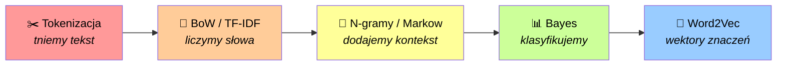

Narracja tego wpisu: **"Najpierw tniesz tekst na kawałki, potem liczysz, potem rozumiesz."** Proste? Zobaczymy ;-) Zaczynamy od cięcia.

---

## Tokenizacja - jak tekst jest dzielony na kawałki

### Problem: komputer nie widzi słów

Wyobraźcie sobie, że jesteście komputerem. Ktoś wam pokazuje tekst:

> "Ala ma kota."

Co widzicie? Literki? Słowa? Nie. Widzicie ciąg bajtów: `65 6c 61 20 6d 61 20 6b 6f 74 61 2e`. Zero pojęcia, gdzie zaczyna się jedno słowo, a kończy drugie. Zero pojęcia, że "kot" to zwierzak, a nie trzy losowe znaki.

Żeby komputer cokolwiek mógł zrobić z tekstem, musi go najpierw **pociąć na kawałki**. I ten proces nazywa się **tokenizacją**.

Tokenizacja to **krok zerowy**. Bez niej nie ma TF-IDF, nie ma n-gramów, nie ma embeddingów, nie ma LLM. Wszystko zaczyna się od cięcia.

### Naiwne podejście: tnij po spacjach

Najprostszy pomysł: dzielimy tekst po spacjach.

```
"Ala ma kota." → ["Ala", "ma", "kota."]
```

Zauważyliście? "kota." ma kropkę przyklejoną. To nie jest słowo "kot" w dopełniaczu - to jest słowo "kota" z interpunkcją. A co z takimi tekstami:

- "nie-przy-stoj-ny" → jedno słowo czy pięć?
- "Cześć!" → słowo + interpunkcja?
- "New York" → jedno słowo czy dwa?
- ":) " → słowo? znak? emocja?

Krótko: **cięcie po spacjach nie działa**. Świat jest za skomplikowany na tak proste reguły.

### Token ≠ słowo ≠ morfem

W [pierwszym poście](cechy-jezykowe-a-llm.html) poznaliśmy morfemy - najmniejsze jednostki znaczące. "Nieszczęśliwy" to trzy morfemy: "nie-szczęśliw-y". A teraz uwaga: **token to nie to samo co morfem.**

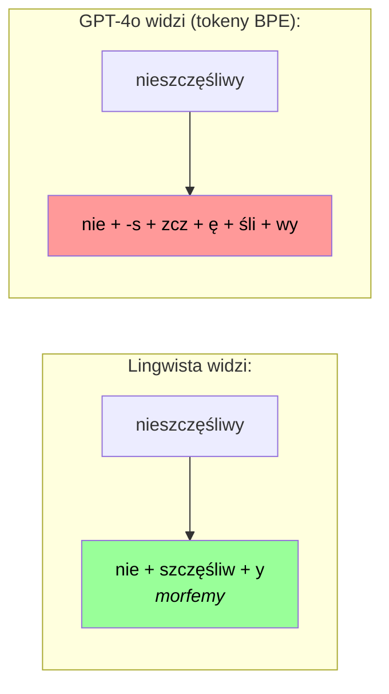

Token to po prostu **kawałek tekstu** wyznaczony przez tokenizator. Może być całym słowem, może być częścią słowa, może być pojedynczym znakiem. Zależy od algorytmu.

> [!NOTE]
> **Trzy poziomy cięcia tekstu:**
> - **Słowo** - jednostka, którą intuicyjnie "czujesz" (oddzielona spacjami)
> - **Morfem** - najmniejsza jednostka ZNACZĄCA w języku (nie-, szczęśliw-, -y)
> - **Token** - kawałek tekstu wyznaczony przez ALGORYTM komputerowy (nie, -s, zcz, ę, śli, wy)

### BPE - Byte Pair Encoding

I tu wchodzi **BPE (Byte Pair Encoding)** - najpopularniejszy algorytm tokenizacji, używany przez GPT-2, GPT-3, GPT-4, Llama, i wiele innych modeli.

Ideę BPE można sprowadzić do jednego zdania: **szukamy najczęstszej pary znaków i łączymy ją w jeden token. I powtarzamy.**

Brzmi prosto? Bo jest proste ;-) Zobaczmy to na przykładzie.

#### BPE krok po kroku

Mamy mały korpus z pięcioma polskimi słowami i ich częstotliwościami:

```
"las"  ×10     "lak"  ×5      "lat"  ×12
"bat"  ×4      "lasy" ×5
```

("las" = las, "lak" = lak do pieczęci, "lat" = lat (od "rok"), "bat" = bicz, "lasy" = po prostu lasy)

**Krok 0:** Dzielimy wszystko na pojedyncze znaki:

```
l a s    ×10     l a k    ×5      l a t    ×12
b a t    ×4      l a s y  ×5
```

Nasz początkowy słownik to: `["a", "b", "k", "l", "s", "t", "y"]` - po prostu wszystkie unikalne znaki.

**Krok 1:** Znajdujemy najczęstszą parę sąsiadujących znaków:
- (l, a) występuje w "las" (10), "lak" (5), "lat" (12) i "lasy" (5) = **32 razy** ← zwycięzca!
- (a, t) występuje w "lat" (12) i "bat" (4) = 16 razy
- (a, s) występuje w "las" (10) i "lasy" (5) = 15 razy

Łączymy (l, a) → **"la"**. Nasz słownik rośnie o jeden token:

```
Słownik: ["a", "b", "k", "l", "s", "t", "y", "la"]

la s     ×10     la k     ×5      la t     ×12
b a t    ×4      la s y   ×5
```

**Krok 2:** Znowu szukamy najczęstszej pary:
- (la, s) występuje w "las" (10) i "lasy" (5) = **15 razy** ← zwycięzca!
- (la, t) występuje w "lat" (12) = 12 razy
- (la, k) występuje w "lak" (5) = 5 razy

Łączymy (la, s) → **"las"**:

```
Słownik: ["a", "b", "k", "l", "s", "t", "y", "la", "las"]

las      ×10     la k     ×5      la t     ×12
b a t    ×4      las y    ×5
```

**Krok 3:** Najczęstsza para to teraz (la, t) = 12 razy. Łączymy → **"lat"**:

```
Słownik: [..., "la", "las", "lat"]

las      ×10     la k     ×5      lat      ×12
b a t    ×4      las y    ×5
```

**Krok 4:** Najczęstsza para to (la, k) = 5 razy. Łączymy → **"lak"**:

```
Słownik: [..., "la", "las", "lat", "lak"]

las      ×10     lak      ×5      lat      ×12
b a t    ×4      las y    ×5
```

**Krok 5:** Najczęstsza para to (las, y) = 5 razy. Łączymy → **"lasy"**:

```
Słownik: [..., "la", "las", "lat", "lak", "lasy"]

las      ×10     lak      ×5      lat      ×12
b a t    ×4      lasy     ×5
```

I tak dalej, aż osiągniemy docelowy rozmiar słownika. W prawdziwych modelach:
- **GPT-2** ma słownik **50 257** tokenów (256 bajtów + 50 000 scalenia + 1 specjalny)
- **GPT-4/o** ma słownik ~**100 000** tokenów
- **Llama 3** też używa około ~**100 000** tokenów

### Kiedy tokenizer jest używany?

To ważne pytanie, bo odpowiedź brzmi: **zawsze. Na obu etapach.**

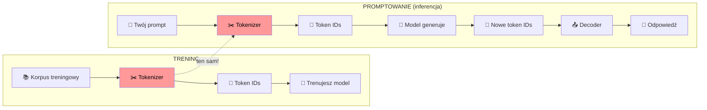

1. **Trening:** najpierw trenujesz tokenizer na ogromnym korpusie (uczy się, które pary scalać). Potem tokenizujesz CAŁY korpus treningowy na ID-ki. Model uczy się na tych ID-kach.

2. **Promptowanie:** kiedy piszesz do ChatGPT, twój tekst przechodzi przez ten **SAM tokenizer** → ID-ki → model generuje nowe ID-ki → decoder zamienia z powrotem na tekst.

Kluczowe: **tokenizer jest trenowany osobno, przed modelem.** Potem jest "zamrożony" - nie zmienia się już nigdy. GPT-2 ma swój tokenizer (słownik 50K), GPT-4 ma swój (słownik 100K). I to jest powód, dla którego polski jest cięty gorzej w GPT-2 - bo **tokenizer** GPT-2 był trenowany głównie na angielskim, więc mało polskich ciągów znaków zostało scalonych. Model sam mógłby "rozumieć" polski lepiej, ale tokenizer już mu pociął tekst na drobne kawałki.

> [!TIP]
> **Eksperyment dla was:** Wejdźcie na [tiktokenizer.vercel.app](https://tiktokenizer.vercel.app/), wpiszcie jakiś tekst po polsku i zobaczcie, jak model GPT-2 tnie go na tokeny. Zobaczycie, że polskie znaki (ą, ę, ł, ś, ć) często zajmują po 2-3 tokeny! Bo GPT-2 był trenowany głównie na angielskim, więc polski jest dla niego "egzotyczny".

### Różne modele - różne cięcie

Kluczowa rzecz: **każdy model ma swój własny tokenizator**. Ten sam tekst może być pocięty zupełnie inaczej:

```python
import tiktoken

text = "Nieprawdopodobnie szczęśliwy"

gpt2 = tiktoken.get_encoding("gpt2")
gpt4 = tiktoken.get_encoding("cl100k_base")

print("GPT-2:", gpt2.encode(text))
print("GPT-4:", gpt4.encode(text))

print("GPT-2:", [gpt2.decode([t]) for t in gpt2.encode(text)])
print("GPT-4:", [gpt4.decode([t]) for t in gpt4.encode(text)])
```

GPT-2 prawdopodobnie potnie polski tekst na mnóstwo małych fragmentów (bo nie "zna" polskiego dobrze), a GPT-4 zrobi to o wiele efektywniej (bo widział więcej polskiego tekstu).

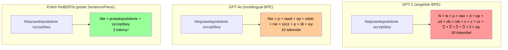

### A co z polskimi tokenizatorami?

Istnieją modele trenowane specjalnie na polskim tekście - i ich tokenizatory tną polski **znacznie** lepiej:

```python
from transformers import AutoTokenizer

text = "Nieprawdopodobnie szczęśliwy"

herbert = AutoTokenizer.from_pretrained("allegro/herbert-base-cased")
print("HerBERT (Allegro, polski WordPiece):", herbert.tokenize(text))

roberta = AutoTokenizer.from_pretrained("sdadas/polish-roberta-base-v2")
print("Polish RoBERTa (polski SentencePiece):", roberta.tokenize(text))
```

```
HerBERT (Allegro, polski WordPiece):  ['Nie', 'prawdopodobnie</w>', 'szczęśliwy</w>']  → 3 tokeny
Polish RoBERTa (polski SentencePiece): ['▁Nie', 'prawdopodobnie', '▁szczęśliwy']        → 3 tokeny
```

Trzy tokeny! "prawdopodobnie" i "szczęśliwy" to dla polskiego tokenizera pojedyncze tokeny. Bo ten tokenizer "widział" te słowa na polskim korpusie tyle razy, że scalił je w całe jednostki.

Dwa polskie tokenizery, które warto znać:

| Tokenizer | Twórca | Algorytm | Zaimplementowany w |
|---|---|---|---|
| **HerBERT** | Allegro | WordPiece | polski BERT na KGR10 korpusie |
| **Polish RoBERTa** | sdadas | SentencePiece (Unigram) | polski RoBERTa na dużym korpusie |

> [!NOTE]
> **Dlaczego polskie modele tną lepiej?** Bo ich tokenizery były trenowane **na polskim tekście**. "prawdopodobnie" występowało w polskim korpusie tysiące razy, więc BPE/SentencePiece scalił je w jeden token. GPT-2 widział głównie angielski, więc "prawdopodobnie" mu się nie scaliło - i tnie je na kawałki. To jest też powód, dla którego GPT-4o (trenowany na dużo bardziej wielojęzycznym korpusie) tnie polski lepiej niż GPT-2 - ale nadal gorzej niż typowo polskie modele.

### Stwórz własny polski tokenizer!

Skoro już rozumiemy, jak BPE działa, spróbujmy wytrenować **własny tokenizer** na polskim tekście. Użyjemy biblioteki `tokenizers` od HuggingFace (nie mylić z `tiktoken`):

```python
from tokenizers import Tokenizer
from tokenizers.models import BPE
from tokenizers.trainers import BpeTrainer
from tokenizers.pre_tokenizers import Whitespace

tokenizer = Tokenizer(BPE(unk_token="[UNK]"))
tokenizer.pre_tokenizer = Whitespace()

trainer = BpeTrainer(vocab_size=300, special_tokens=["[UNK]"])

corpus = [
    "Ala ma kota i psa",
    "Kot siedzi na macie",
    "Pies biega po parku",
    "Ala ma kota i kota i jeszcze raz kota",
    "Kot lubi mleko i kot lubi spać",
    "Pies lubi biegać po parku i gonić kota",
    "Szczęśliwy kot to kot który ma dużo mleka",
    "Nieprawdopodobnie szczęśliwy pies biega po parku",
    "Szczęśliwy Ala ma kota i psa i szczęśliwy dom",
    "Dom to miejsce gdzie mieszka szczęśliwa rodzina",
]

tokenizer.train_from_iterator(corpus, trainer)
print(f"Rozmiar słownika: {tokenizer.get_vocab_size()}")

test = "Nieprawdopodobnie szczęśliwy"
encoding = tokenizer.encode(test)
print(f'"{test}" → {encoding.tokens}')
```

```
Rozmiar słownika: 130
"Nieprawdopodobnie szczęśliwy" → ['Nieprawdopodobnie', 'szczęśliwy']
```

**Dwa tokeny!** Bo nasz mały korpus jest po polsku - i "Nieprawdopodobnie" oraz "szczęśliwy" wystąpiły wystarczająco często, żeby BPE scalił je w pojedyncze tokeny.

Ale chwila - co właściwie znaczą te parametry w kodzie?

| Parametr | Co robi | Przykład |
|---|---|---|
| **`vocab_size`** | Maksymalna liczba tokenów w słowniku. BPE będzie scalał pary, aż słownik osiągnie ten rozmiar. Im większy, tym dłuższe tokeny (całe słowa). Im mniejszy, tym mniejsze kawałki (pojedyncze litery). | GPT-2: 50 257, nasz: 300 |
| **`special_tokens`** | Tokeny o specjalnym znaczeniu dla modelu. Zawsze są w słowniku, niezależnie od treningu. | `[UNK]`, `<PAD>`, `<S>` (start), `</S>` (koniec) |
| **`unk_token`** | Token "nieznany" - zastępuje każdy znak, którego tokenizer nie potrafi rozpoznać. Np. jeśli w tekście pojawi się emoji, a tokenizer nie ma go w słowniku, wstawi `[UNK]`. | `[UNK]` = "nie wiem co to jest" |

Prosta analogia: `vocab_size` to grubość waszego słownika - ile haseł się w nim zmieści. `unk_token` to hasło oznaczające "nie ma takiego słowa". A `special_tokens` to "strony zarezerwowane" - zawsze są w słowniku, niezależnie od tego, czego nauczysz tokenizer.

> [!TIP]
> **Eksperyment:** Skopiujcie ten kod, zmieńcie `vocab_size` na np. 50 i zobaczcie, co się stanie. Zobaczycie, że przy mniejszym słowniku tokenizer tnie słowa na mniejsze kawałki - bo ma mniej "miejsca" na scalenia. To jest dokładnie to, o czym mówiliśmy: rozmiar słownika to hiperparametr, i to od niego zależy, jak drobno tekst jest cięty.

> [!WARNING]
> **Dlaczego to ma znaczenie?** Bo LLM ma limit tokenów w oknie kontekstowym. GPT-3 ma 4K tokenów, GPT-4 Turbo ma 128K. Ale "token" to nie "słowo"! W angielskim ~1 token ≈ 0.75 słowa. W polskim, zwłaszcza z GPT-2, to może być ~1 token ≈ 0.4 słowa. Czyli polski tekst "zjada" więcej tokenów i szybciej wyczerpuje limit.

### Inne algorytmy tokenizacji

BPE to nie jedyny gracz w mieście. Oto krótkie zestawienie:

| Algorytm | Kto używa | Jak działa | Kluczowa różnica |
|---|---|---|---|
| **BPE** | GPT, Llama, many others | Scala najczęstszą parę | Prosty, od dołu |
| **WordPiece** | BERT, DistilBERT, Electra | Scala parę z najwyższym "score" | Score = freq(pary) / (freq(a) × freq(b)) |
| **Unigram** | T5, Pegasus, ALBERT | Zaczyna od dużego słownika, usuwa najmniej przydatne | Probabilistyczny, może dawać różne tokenizacje |
| **SentencePiece** | Wielojęzyczne modele | BPE lub Unigram na surowym tekście (nawet bez spacji!) | Działa z językami bez spacji (chiński, japoński) |

Różnica między BPE a WordPiece jest subtelna: BPE scala po prostu **najczęstszą** parę. WordPiece scala parę, która jest **najbardziej zaskakująca** - czyli występuje razem częściej niż by wynikało z częstotliwości poszczególnych elementów. To trochę jak związek, który jest "bardziej niż suma części" ;-)

> [!NOTE]
> **Nawiązanie do posta 1:** Pamiętacie, jak mówiliśmy, że polska morfologia to koszmar dla LLM? 7 przypadków, fleksja, mnóstwo końcówek... No to teraz widzicie dlaczego. Tokenizator nie "wie", że "domu", "domowi", "domem" to odmiany tego samego słowa. Dla niego to po prostu różne sekwencje znaków. To "zrozumienie" relacji między formami - tego model musi się nauczyć sam, w trakcie treningu.

### Quiz: jak BPE to potnie?[^1]

Mamy nasze scalenia z powyższego przykładu: l+a→la, la+s→las, la+t→lat, la+k→lak, las+y→lasy. Jak BPE podzieli te nowe słowa?

1. "klasa" (zakładając, że nie było w korpusie)
2. "lata" (zakładając, że nie było w korpusie)
3. "laska" (popularne polskie słowo!)

---

## Korpusy, Bag-of-Words i TF-IDF

### Co to jest korpus?

OK, mamy tokeny. Ale skąd tokenizator wie, które pary znaków scalać? Z **korpusu**! BPE uczy się najczęstszych połączeń z tekstu. I żeby zrobić cokolwiek z tokenami - policzyć je, znaleźć wzorce, wytrenować model - też potrzebujemy korpusu.

**Korpus** to po prostu zbiór tekstów. Może to być:
- zbiór wszystkich artykułów z Wikipedii
- zbiór recenzji produktów z Allegro
- zbiór maili w Twojej skrzynce
- zbiór wszystkich wpisów na Wykopie (odpukać)

Każdy pojedynczy tekst w korpusie nazywamy **dokumentem**. Proste?

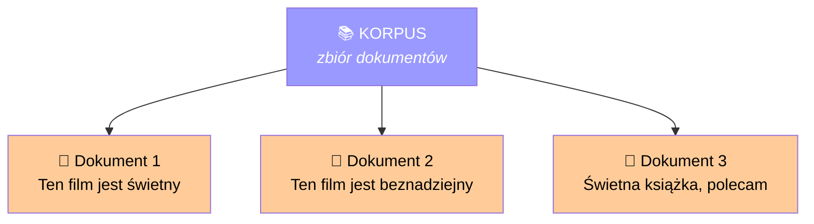

I to są właśnie zbiory danych, na których trenuje się prawdziwe modele - i tokenizery, i same modele:

| Korpus | Co zawiera | Rozmiar | Ciekawostka |
|---|---|---|---|
| **Wikitext** | Artykuły z Wikipedii (angielskiej) | ~500 MB | Standardowy benchmark do ewaluacji modeli językowych |
| **Wiki-40B** | Wikipedia w 59 językach (w tym polskim!) | ~40 GB | Pierwszy krok wielu modeli wielojęzycznych |
| **EuroParl** | Transkrypcje z parlamentu UE (21 języków) | ~2 GB | Wysokiej jakości teksty oficjalne, świetny do tłumaczeń |
| **Common Crawl** | Zrzuty treści ze stron internetowych | **petabajty** (PB!) | Największy publicznie dostępny korpus webowy. Większość LLM-ów z niego korzysta |
| **OpenWebText** | Kopia linków z Reddita z >3 punktami oceny | ~38 GB | Z niego trenowano GPT-2. Filtrowana "jakość" z Reddita |
| **The Pile** | Mix 22 źródeł (arXiv, GitHub, Wikipedia, książki...) | ~825 GB | Stworzony przez EleutherAI jako zbiór "do wszystkiego" |
| **RedPajama** | Otwarta replika danych treningowych LLaMA | ~1.2 TB | To dlatego LLaMA jest tak dobra - trenowana na ogromnym, różnorodnym zbiorze |
| **OSCAR** | Zrzuty z internetu, filtrowane po językach | ~6.5 TB | Ma osobne podzbiory dla każdego języka, w tym polski OSCAR |

A polskie korpusy? Oto najważniejsze:
- **NKJP** (Narodowy Korpus Języka Polskiego) - miliony polskich tekstów, zrównoważony zbiór z różnych dziedzin
- **Polish-ROBERTa corpus** - ~20 GB polskiego tekstu z internetu, na nim trenowano Polish RoBERTa
- **OSCAR (polska część)** - polskie strony z Common Crawl, kilkaset GB
- **Wikipedia po polsku** - ~2 GB artykułów, często punkt wyjścia do polskich modeli

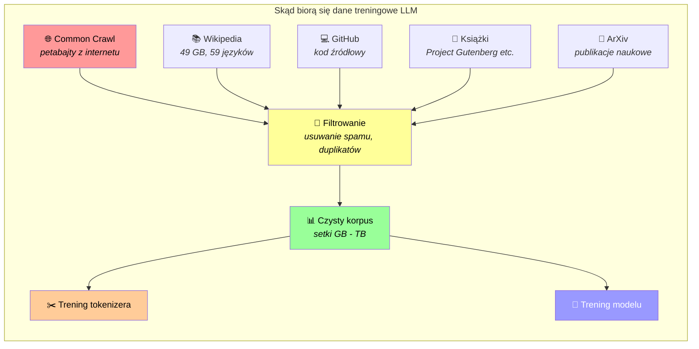

Kluczowa obserwacja: **ten sam korpus służy do trenowania tokenizera i modelu.** Najpierw trenujesz tokenizer na korpusie (uczy się, które pary znaków scalać), potem tokenizujesz cały korpus za pomocą tego tokenizera, i na tych tokenach trenujesz model.

> [!NOTE]
> **Dlaczego to jest ważne?** Jeśli twój korpus ma mało polskiego tekstu (np. GPT-2 trenowany głównie na angielskim), to tokenizer nie scali polskich słów, a model nie nauczy się polskiego dobrze. Dlatego polskie modele (HerBERT, Polish RoBERTa) używają korpusów z dużą ilością polskiego tekstu - np. NKJP + polski OSCAR + polską Wikipedię.

### Bag-of-Words - torba pełna słów

Mamy korpus. Teraz chcemy zamienić każdy dokument na **liczby**, żeby komputer mógł z tym coś zrobić.

Najprostszy sposób: **Bag-of-Words (BoW)** - torba słów. Liczymy, ile razy każde słowo występuje w dokumencie.

Przykład. Mamy trzy krótkie recenzje filmu:

```
Dokument 1: "Ten film jest świetny"
Dokument 2: "Ten film jest beznadziejny"
Dokument 3: "Świetny film polecam"
```

Budujemy słownik wszystkich unikalnych słów:
```
{ten, film, jest, świetny, beznadziejny, polecam}
```

I teraz każdy dokument zamieniamy na wektor zliczeń:

| | ten | film | jest | świetny | beznadziejny | polecam |
|---|---|---|---|---|---|---|
| **Dok 1** | 1 | 1 | 1 | 1 | 0 | 0 |
| **Dok 2** | 1 | 1 | 1 | 0 | 1 | 0 |
| **Dok 3** | 0 | 1 | 0 | 1 | 0 | 1 |

Każdy dokument to teraz po prostu ciąg liczb. Komputer jest happy.

Ale my nie do końca ;-) Bo zauważcie problem:

> Dokument 1: "Ten film jest świetny" → [1, 1, 1, 1, 0, 0]  
> Dokument 2: "Ten film jest beznadziejny" → [1, 1, 1, 0, 1, 0]

Te wektory są prawie identyczne! Różnią się na jednej pozycji. A przecież jeden mówi "świetny", a drugi "beznadziejny" - zupełnie inne znaczenie.

I jest drugi problem: "Dog bites man" i "Man bites dog" dadzą **dokładnie ten sam** wektor BoW. BoW kompletnie **ignoruje kolejność słów**.

> [!NOTE]
> **Dlaczego po polsku to nie działa tak samo?** Bo polski ma przypadki! "Pies gryzie człowieka" i "Człowiek gryzie psa" to dla BoW **różne** zdania - bo "pies" ≠ "psa" i "człowieka" ≠ "człowiek". To są inne słowa. Angielski nie ma przypadków, więc "dog" to zawsze "dog" niezależnie od roli w zdaniu - i dlatego BoW nie odróżnia "dog bites man" od "man bites dog". To jest właśnie ta polska morfologia z [pierwszego posta](cechy-jezykowe-a-llm.html), która czasem nam pomaga, a czasem przeszkadza ;-)

> [!WARNING]
> **Bag-of-Words w pigułce:**
> - Plus: banalnie prosty, działa szybko
> - Minus: ignoruje kolejność, ignoruje znaczenie, ignoruje kontekst
> - Metafora: wrzucasz wszystkie słowa do torby, potrząsasz, i patrzysz co wypadnie. Torba nie wie, co było pierwsze, a co ostatnie.

### Bag-of-Words w kodzie

```python
from sklearn.feature_extraction.text import CountVectorizer
import pandas as pd

corpus = [
    "Ten film jest świetny",
    "Ten film jest beznadziejny",
    "Świetny film polecam",
]

vectorizer = CountVectorizer()
X = vectorizer.fit_transform(corpus)

df = pd.DataFrame(
    X.toarray(),
    columns=vectorizer.get_feature_names_out(),
    index=["Dok 1", "Dok 2", "Dok 3"]
)
print(df)
```

Wynik:

```
        beznadziejny  film  jest  polecam  świetny  ten
Dok 1              0     1     1        0        1    1
Dok 2              1     1     1        0        0    1
Dok 3              0     1     0        1        1    0
```

Dokładnie ta sama tabela, co wyżej - tylko teraz wygenerowana przez kod. Zauważcie: "film" jest wszędzie (wartość 1 w każdym wierszu), a "beznadziejny" tylko w Dokumencie 2. To jest cała magia BoW - proste zliczanie.

> [!IMPORTANT]
> **Czy BoW potrafi generować nowe teksty?** Nie. BoW to tylko sposób **reprezentacji** tekstu (tekst → liczby). Służy do analizy, porównywania i klasyfikacji dokumentów, ale nie generuje nic nowego. Nie przewiduje też, jakie słowo powinno pojść po "Kot siedzi na...". Żeby generować tekst, potrzebujemy czegoś, co rozumie **kolejność** słów i potrafi przewidywać następne. I to jest dokładnie to, do czego dochodzimy za chwilę przy n-gramach i łańcuchach Markowa ;-)

### TF-IDF - a co jeśli nie wszystkie słowa są równe?

BoW traktuje każde słowo tak samo. Ale przecież **nie każde słowo jest tak samo ważne**!

Słowo "jest" występuje w niemal każdym polskim zdaniu. Słowo "semiotyka" - raczej rzadko. Które jest bardziej informatywne? Oczywiście "semiotyka" - bo jeśli widzisz to słowo w dokumencie, to dużo więcej mówi ci o jego treści niż "jest".

TF-IDF (Term Frequency - Inverse Document Frequency) to sposób, żeby to uchwycić.

Przypomnijmy nasz korpus - trzy krótkie recenzje filmu:

```
Dokument 1: "Ten film jest świetny"         (4 słowa)
Dokument 2: "Ten film jest beznadziejny"     (4 słowa)
Dokument 3: "Świetny film polecam"            (3 słowa)
```

Policzmy TF-IDF dla słowa **"świetny"** w Dokumencie 1:

**TF (Term Frequency)** - jak często słowo występuje w jednym dokumencie:
```
TF("świetny", Dokument 1) = 1 / 4 = 0.25
```
(1 wystąpienie w 4-słowowym dokumencie)

**IDF (Inverse Document Frequency)** - jak "rzadkie" jest słowo w całym korpusie:
```
IDF("świetny") = log(3 / 2) = 0.176
```
(3 dokumenty w korpusie, 2 z nich zawierają "świetny")

**TF-IDF** = TF × IDF:
```
TF-IDF("świetny", Dokument 1) = 0.25 × 0.176 = 0.044
```

A słowo "jest", które jest WSZĘDZIE?
```
IDF("jest") = log(3 / 2) = 0.176  (też w 2 z 3 dokumentów)
IDF("film") = log(3 / 3) = 0      (we WSZYSTKICH dokumentach!)
```

"Film" dostaje **zero** w IDF! Bo jeśli słowo jest w każdym dokumencie, to nie wnosi żadnej informacji, która pomogłaby odróżnić jeden dokument od drugiego.

> [!TIP]
> **Intuicja za TF-IDF w jednym zdaniu:** Słowo jest ważne dla danego dokumentu, jeśli często tam występuje (wysokie TF), ale rzadko w innych dokumentach (wysokie IDF). Czyli: "Czy jesteś wyjątkowy?"

### TF-IDF w kodzie

Spróbujcie sami. Oto kompletny przykład w Pythonie:

```python
from sklearn.feature_extraction.text import TfidfVectorizer
import pandas as pd

corpus = [
    "Ten film jest świetny",
    "Ten film jest beznadziejny",
    "Świetny film polecam",
]

vectorizer = TfidfVectorizer()
tfidf_matrix = vectorizer.fit_transform(corpus)

df = pd.DataFrame(
    tfidf_matrix.toarray(),
    columns=vectorizer.get_feature_names_out(),
    index=["Dok 1", "Dok 2", "Dok 3"]
)
print(df.round(2))
```

Wynik będzie wyglądał mniej więcej tak:

```
       beznadziejny  film   jest   polecam  świetny   ten
Dok 1         0.00  0.37  0.49     0.00     0.37   0.49
Dok 2         0.58  0.35  0.46     0.00     0.00   0.46
Dok 3         0.00  0.41  0.00     0.54     0.41   0.00
```

Zauważcie: "film" ma niskie wartości wszędzie (bo jest wszędzie). "beznadziejny" ma wysoką wartość tylko w Dokumencie 2 (bo tylko tam występuje). TF-IDF działa!

> [!TIP]
> **Eksperyment dla was:** Pomyślcie o waszych notatkach ze studiów (albo z pracy). Jakie słowa miałyby wysokie TF-IDF? Prawdopodobnie terminy fachowe - "rekurencja", "entropy", "backpropagation". A jakie miałyby niskie? "I", "jest", "na", "że" - bo są wszędzie.

### TF-IDF jako wyszukiwarka

TF-IDF ma jedno super praktyczne zastosowanie: **przeszukiwanie tekstu**. To jest właściwie to, jak działały pierwsze wyszukiwarki internetowe.

Idea jest prosta: zamieniasz zapytanie użytkownika na wektor TF-IDF, i szukasz dokumentu, którego wektor jest do niego **najbardziej podobny** (tzw. podobieństwo kosinusowe).

```python
from sklearn.feature_extraction.text import TfidfVectorizer
from sklearn.metrics.pairwise import cosine_similarity
import numpy as np

corpus = [
    "Ten film jest świetny",
    "Ten film jest beznadziejny",
    "Świetny film polecam",
]

vectorizer = TfidfVectorizer()
tfidf_matrix = vectorizer.fit_transform(corpus)

query = "świetny film"
query_vec = vectorizer.transform([query])

similarities = cosine_similarity(query_vec, tfidf_matrix)[0]
ranked = sorted(zip(corpus, similarities), key=lambda x: -x[1])
for i, (doc, sim) in enumerate(ranked, 1):
    print(f'{i}. "{doc}" → {sim:.3f}')
```

```
Zapytanie: "świetny film"

1. "Świetny film polecam"         → 0.694  ← najlepszy wynik!
2. "Ten film jest świetny"       → 0.667
3. "Ten film jest beznadziejny"   → 0.229
```

Dokument 3 wygrywa - bo "świetny" i "film" to dla niego słowa-klucze o wysokim TF-IDF. Dokument 2 ma "film", ale nie ma "świetny" - więc jego podobieństwo jest niskie.

> [!NOTE]
> **Podobieństwo kosinusowe** mierzy kąt między dwoma wektorami. Jeśli wektory wskazują w tym samym kierunku (podobne proporcje słów) - podobieństwo jest bliskie 1. Jeśli w przeciwnych - bliskie 0. Nie przejmujcie się matematyką - intuicja jest prosta: "jak bardzo te dwa wektory są do siebie podobne?"

---

## N-gramy - czyli dodajemy kontekst

### Problem: słowa nie żyją w próżni

TF-IDF jest lepszy niż czysty BoW, bo przynajmniej waży słowa według ważności. Ale nadal traktuje każde słowo **osobno**. Nie wie, że "nie" + "lubię" = coś zupełnie innego niż "lubię" samo.

Albo przykład z angielskiego, który świetnie pokazuje problem:

- "big red **machine** and carpet" - mówimy o maszynie
- "big red **carpet** and machine" - mówimy o dywanie

Same słowa są te same! Ale kolejność zmienia wszystko. BoW i TF-IDF tego nie widzą.

### Czym są n-gramy?

**N-gram** to po prostu ciąg N kolejnych elementów (zwykle słów albo znaków).

Przykład ze zdaniem "Ala ma kota":

| Typ | N | Wynik |
|---|---|---|
| Unigramy | 1 | Ala, ma, kota |
| Bigramy | 2 | Ala ma, ma kota |
| Trigramy | 3 | Ala ma kota |

I teraz magia: zamiast liczyć pojedyncze słowa, liczymy **pary słów** (bigramy). I nagle:

- "nie lubię" staje się jednym bytem (negacja + czasownik = negatywny sens)
- "big red" i "red carpet" to różne rzeczy
- "New York" to jedna jednostka, nie dwa słowa

Można też łączyć n-gramy z TF-IDF! W sklearn wystarczy zmienić jeden parametr:

```python
from sklearn.feature_extraction.text import TfidfVectorizer
import pandas as pd

corpus = [
    "Ten film jest świetny",
    "Ten film jest beznadziejny",
    "Świetny film polecam",
]

vectorizer = TfidfVectorizer(ngram_range=(1, 2))
tfidf_matrix = vectorizer.fit_transform(corpus)

df = pd.DataFrame(
    tfidf_matrix.toarray(),
    columns=vectorizer.get_feature_names_out(),
    index=["Dok 1", "Dok 2", "Dok 3"]
)
print(df.round(2))
```

```
       beznadziejny  film  film jest  film polecam  jest  jest beznadziejny  jest świetny  polecam   ten  ten film  świetny  świetny film
Dok 1          0.00  0.29       0.37           0.0  0.37               0.00          0.49      0.0  0.37      0.37     0.37           0.0
Dok 2          0.46  0.27       0.35           0.0  0.35               0.46          0.00      0.0  0.35      0.35     0.00           0.0
Dok 3          0.00  0.30       0.00           0.5  0.00               0.00          0.00      0.5  0.00      0.00     0.38           0.5
```

Zobaczcie, co się stało - słownik cech urósł! Oprócz pojedynczych słów ("film", "jest", "świetny") mamy teraz **pary**: "film jest", "jest świetny", "jest beznadziejny", "świetny film", "ten film", "film polecam". Każda para to osobna kolumna z własnym TF-IDF.

Dzięki temu model widzi, że "jest świetny" (Dok 1) i "jest beznadziejny" (Dok 2) to **różne rzeczy** - bo to różne bigramy z różnymi wartościami TF-IDF.

> [!NOTE]
> **N-gramy to kompromis.** Im większe N, tym więcej kontekstu łapiesz, ale tym więcej danych potrzebujesz. Z trigramami masz 3× więcej kombinacji niż z unigramami. Z 4-gramami - jeszcze więcej. I szybko dochodzisz do momentu, gdzie większość n-gramów występuje w korpusie tylko raz, co nie jest przydatne.

### Łańcuchy Markowa - gdy n-gramy zaczynają "przewidywać"

Same n-gramy to tylko zliczenia - tak jak BoW, nie generują tekstu. Ale jeśli dodamy do nich **prawdopodobieństwa przejść**, nagle zyskujemy coś, co **generuje nowy tekst**.

Pomysł jest prosty: dla każdego słowa patrzymy, jakie słowa najczęściej po nim następują. I wybieramy następne słowo probabilistycznie.

Weźmy mały korpus:

```
"ala ma kota ala ma psa kot lubi mleko ala lubi kota"
```

Liczymy bigramy i prawdopodobieństwa przejść:

| Słowo | Następne słowo | Prawdopodobieństwo |
|---|---|---|
| **ala** | ma | 2/3 = **67%** |
| **ala** | lubi | 1/3 = 33% |
| **ma** | kota | 1/2 = 50% |
| **ma** | psa | 1/2 = 50% |
| **kot** | lubi | 1/1 = 100% |
| **lubi** | mleko | 1/2 = 50% |
| **lubi** | kota | 1/2 = 50% |

To jest właśnie **łańcuch Markowa** - model, w którym prawdopodobieństwo następnego stanu zależy **tylko od obecnego stanu** (albo kilku ostatnich).

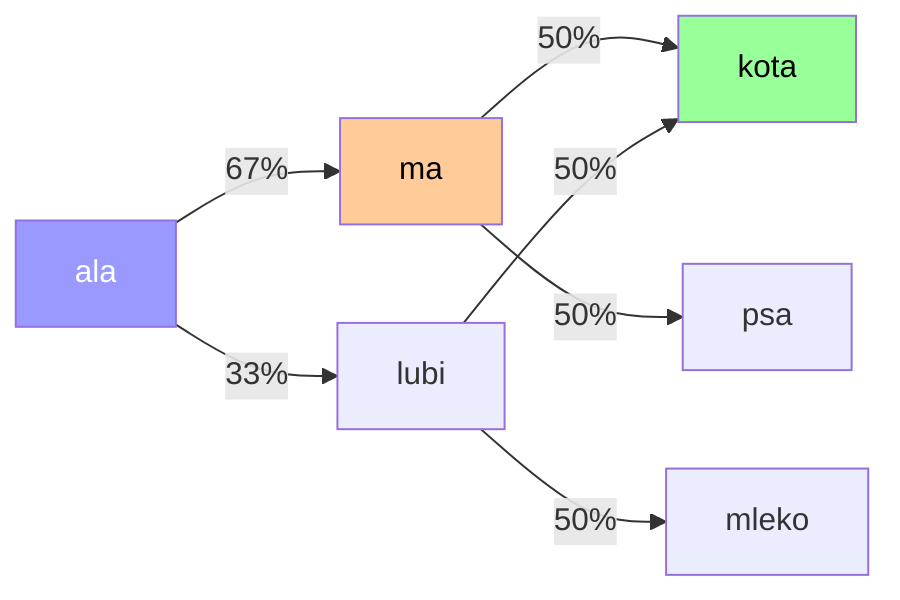

"ala" → najczęściej "ma" (67%) → "kota" albo "psa" (po 50%). Czyli generujemy np.: "ala ma kota". Albo "ala ma psa". Albo "ala lubi kota". Wszystkie te zdania są "nowe" - nie wystąpiły jako całości w korpusie - ale model skleił je z prawdopodobieństw przejść.

### Jak to działa pod spodem - krok po kroku

Zanim przejdziemy do kodu, prześledźmy cały proces na palcach. Mamy ten sam korpus:

```
"ala ma kota ala ma psa kot lubi mleko ala lubi kota"
```

**Krok 1: Budujemy słownik trigramów.** Przesuwamy "okienko" o 3 słowa i patrzymy, co jest za nim:

| Okno (trigram) | Następne słowo |
|---|---|
| ala ma **kota** | ala |
| ma kota **ala** | ma |
| kota ala **ma** | psa |
| ala ma **psa** | kot |
| ma psa **kot** | lubi |
| psa kot **lubi** | mleko |
| kot lubi **mleko** | ala |
| lubi mleko **ala** | lubi |
| mleko ala **lubi** | kota |

Każdy trigram ma dokładnie jedno możliwe następne słowo (bo nasz korpus jest malutki).

**Krok 2: Generujemy.** Zaczynamy od trigramu startowego `("ala", "ma", "kota")`:

> [!IMPORTANT]
> **Ten trigram startowy to nasz "prompt"!** Tak samo jak w ChatGPT wpisujesz tekst i model kontynuuje - tu wpisujemy "ala ma kota" i generator dobiera kolejne słowa. Jedyna różnica to skala: ChatGPT ma kontekst na tysiące tokenów, a my na 3 słowa.

```
Start:    ala ma kota
Krok 1:   ala ma kota [ala]     ← po (ala,ma,kota) następuje "ala"
Krok 2:   ala ma kota ala [ma]  ← po (ma,kota,ala) następuje "ma"
Krok 3:   ala ma kota ala ma [psa]   ← po (kota,ala,ma) następuje "psa"
Krok 4:   ... ma psa [kot]      ← po (ala,ma,psa) następuje "kot"
Krok 5:   ... psa kot [lubi]    ← po (ma,psa,kot) następuje "lubi"
Krok 6:   ... kot lubi [mleko]  ← po (psa,kot,lubi) następuje "mleko"
Krok 7:   ... lubi mleko [ala]  ← po (kot,lubi,mleko) następuje "ala"
Krok 8:   ... mleko ala [lubi]  ← po (lubi,mleko,ala) następuje "lubi"
Krok 9:   ... ala lubi [kota]   ← po (mleko,ala,lubi) następuje "kota"
Krok 10:  STOP ← trigram (ala,lubi,kota) nie jest w słowniku
```

Wynik: `"ala ma kota ala ma psa kot lubi mleko ala lubi kota"` - dokładnie nasz korpus, tylko "przeklejony" od środka. Na większym korpusie wynik byłby inny za każdym razem.

### Prosty generator tekstu z n-gramów

Oto kompletny (i naprawdę krótki!) generator tekstu w Pythonie:

```python
import random

corpus = "ala ma kota ala ma psa kot lubi mleko ala lubi kota"
tokens = corpus.split()

trigrams = {}
for i in range(len(tokens) - 3):
    key = (tokens[i], tokens[i + 1], tokens[i + 2])
    next_word = tokens[i + 3]
    if key not in trigrams:
        trigrams[key] = []
    trigrams[key].append(next_word)

current = ("ala", "ma", "kota")  # ← to jest nasz "prompt"!
output = list(current)

for _ in range(10):
    if tuple(output[-3:]) not in trigrams:
        break
    possibilities = trigrams[tuple(output[-3:])]
    output.append(random.choice(possibilities))

print(" ".join(output))
```

Możliwy wynik: `"ala ma kota ala ma psa kot lubi mleko ala ma kota ala ma psa"`

> [!NOTE]
> **Dlaczego za każdym razem wychodzi to samo?** Bo nasz korpus jest tak mały, że większość trigramów ma **tylko jedno** możliwe następne słowo. `random.choice` nie ma z czego wybierać! Na większym korpusie (np. całej polskiej Wikipedii) ten sam kod generowałby **za każdym razem inny tekst** - bo prawie każdy trigram miałby kilka możliwych kontynuacji o różnych prawdopodobieństwach. I to jest właśnie moment, kiedy generowanie staje się interesujące.

Nic wielkiego, prawda? Ale to dlatego, że nasz korpus jest mikroskopijny. Na prawdziwym korpusie (np. całej Wikipedii) generator trigramowy potrafi produkować zdania, które brzmią sensownie, choć nie wystąpiły nigdy wcześniej.

> [!IMPORTANT]
> **Łańcuchy Markowa to pierwsze "modele językowe"!** Przewidywanie następnego słowa na podstawie kontekstu - to jest DOKŁADNIE to, co robi ChatGPT. Oczywiście GPT używa o wiele bardziej zaawansowanej metody (Transformer + attention na tysiącach tokenów kontekstu), ale **fundamentalna idea jest ta sama**: prawdopodobieństwo następnego tokenu. LLM to potomek łańcuchów Markowa. Na sterydach ;-)

---

## Techniki bayesowskie - czyli klasyfikujemy tekst

### A gdybyśmy chcieli nie generować, ale KLASYFIKOWAĆ?

Łańcuchy Markowa są super do generowania tekstu. Ale w praktyce często chcemy coś innego: **przypisać tekst do kategorii**.

- Czy ten mail to **spam** czy **nie-spam**?
- Czy ta recenzja jest **pozytywna** czy **negatywna**?
- Czy ten artykuł jest o **sporcie**, **polityce** czy **technologii**?

I tu wchodzi **Naive Bayes** - jeden z najprostszych, a zarazem najużyteczniejszych algorytmów klasyfikacji tekstu.

### Twierdzenie Bayesa - intuicja

Bez wzorów, samym przykładem:

Wyobraźcie sobie, że idzie do was kolega i mówi: "Kaszlę." Jakie jest prawdopodobieństwo, że ma przeziębienie?

Zależy! Jeśli jest listopad i wszyscy w biurze chorują - wysokie. Jeśli jest lipiec i kaszle raz - niskie.

Twierdzenie Bayesa to formalny sposób myślenia o takich sytuacjach: **aktualizujemy naszą wiedzę na podstawie nowych dowodów.**

A teraz przełóżmy to na tekst. Pytanie brzmi:

> "Jeśli dokument zawiera słowo 'viagra', jakie jest prawdopodobieństwo, że to spam?"

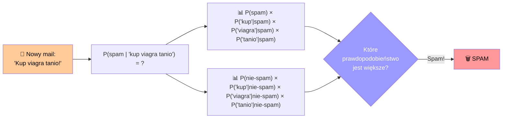

### Naive Bayes w akcji

Mamy mały zbiór maili:

| Mail | Treść | Etykieta |
|---|---|---|
| 1 | "Kup viagra tanio teraz" | Spam |
| 2 | "Viagra darmowa oferta" | Spam |
| 3 | "Spotkanie jutro o 10" | Nie-spam |
| 4 | "Prześlij mi raport jutro" | Nie-spam |

Przychodzi nowy mail: **"Viagra jutro spotkanie"**. Spam czy nie?

Naive Bayes liczy:
1. P(Spam) = 2/4 = 0.5, P(Nie-spam) = 2/4 = 0.5
2. P("viagra" | Spam) = 2/2 = 1.0 (oba spamy mają "viagra")
3. P("viagra" | Nie-spam) = 0/2 = 0.0 (żaden nie-spam nie ma "viagra")
4. P("jutro" | Spam) = 0/2 = 0.0
5. P("jutro" | Nie-spam) = 2/2 = 1.0

P(Spam | "viagra jutro spotkanie") ∝ 0.5 × 1.0 × 0.0 × ... = **0**!

P(Nie-spam | "viagra jutro spotkanie") ∝ 0.5 × 0.0 × 1.0 × ... = **0**!

Ups. Obecność "jutro" (słowo z nie-spamu) wyzerowało spam, a obecność "viagra" (słowo spamowe) wyzerowało nie-spam. Ten konkretny mail jest trudny ;-)

W praktyce stosuje się tzw. **Laplace smoothing** (dodajemy 1 do każdego licznika), żeby uniknąć zerowania:

- P("viagra" | Spam) = (2 + 1) / (7 + 14) = 0.214 (dodajemy 1, dzielimy przez wszystkie słowa w spamie + unikalne słowa)
- P("viagra" | Nie-spam) = (0 + 1) / (7 + 14) = 0.048

Teraz: P(Spam | mail) ∝ 0.5 × 0.214 × 0.048 × 0.048 ≈ **0.000246**
P(Nie-spam | mail) ∝ 0.5 × 0.048 × 0.143 × 0.143 ≈ **0.000490**

Nie-spam wygrywa! Bo "jutro" i "spotkanie" silnie wskazują na normalny mail.

### Dlaczego "Naive"?

Bo zakładamy, że słowa są **niezależne**. Czyli: prawdopodobieństwo wystąpienia "viagra" nie zależy od tego, czy "tanie" też występuje. Oczywiście to nie jest prawda! "Viagra" i "tanie" występują razem częściej niż przypadkiem. Ale model i tak działa zaskakująco dobrze...

To jest trochę jak założenie, że pogoda w Warszawie nie zależy od pogody w Krakowie. Oczywiście trochę zależy! Ale jeśli chcesz szybko oszacować, czy potrzebujesz parasola, to założenie niezależności daje ci w miarę dobrą odpowiedź ;-)

### Klasyfikator spamu w Pythonie

Skoro już rozumiemy matematykę, zróbmy to w kilku linijkach kodu. Biblioteka `scikit-learn` ma gotowy klasyfikator Naive Bayes:

- **`CountVectorizer`** - zamienia tekst na wektor zliczeń słów (czyli nasz BoW z poprzedniej sekcji)
- **`MultinomialNB`** - to jest właśnie Naive Bayes, tzw. "wielomianowy" (bo liczy prawdopodobieństwa słów), z `alpha=1.0` czyli Laplace smoothing

```python
from sklearn.naive_bayes import MultinomialNB
from sklearn.feature_extraction.text import CountVectorizer

emails = [
    "Kup viagra tanio teraz",
    "Viagra darmowa oferta",
    "Spotkanie jutro o 10",
    "Prześlij mi raport jutro",
    "Tanie leki online kup teraz",
    "Raport z wczoraj prześlij",
]
labels = [1, 1, 0, 0, 1, 0]  # 1=spam, 0=nie-spam

vectorizer = CountVectorizer()
X = vectorizer.fit_transform(emails)

classifier = MultinomialNB(alpha=1.0)
classifier.fit(X, labels)

new_email = vectorizer.transform(["Viagra jutro spotkanie"])
prediction = classifier.predict(new_email)
print("Spam!" if prediction[0] == 1 else "Nie-spam.")
```

> [!TIP]
> **Eksperyment dla was:** Stwórzcie 5 pozytywnych zdań o filmie ("Ten film był niesamowity!", "Wspaniała akcja!", ...) i 5 negatywnych ("Nudny jak flaki z olejem", "Strata czasu", ...). Wypiszcie słowa, które występują TYLKO w pozytywnych i TYLKO w negatywnych. To jest intuicja Naive Bayes - każde słowo "głosuje" na jedną z kategorii.

> [!WARNING]
> **Ograniczenie:** Naive Bayes widzi słowa, ale nie kontekst. "Film jest NIESAMOWITY... żesz beznadziejny" - model zobaczy "niesamowity" i powie "pozytywny". Nie ogarnia ironii ani złożonych konstrukcji. Potrzebujemy czegoś, co rozumie **relacje między słowami**. I tu wchodzimy w świat wektorów...

---

## Word2Vec - słowa stają się geometrią

### Moment "eureka"

Wszystkie metody, które dotąd poznaliśmy, mają jeden wspólny problem: **traktują słowa jako dyskretne, niezależne byty**. W BoW "kot" jest na pozycji 47 w wektorze, "pies" na pozycji 138. Nie ma między nimi żadnej relacji.

A przecież MY wiemy, że "kot" i "pies" są do siebie podobne - oba to zwierzęta domowe. "Kot" i "samochód" - zupełnie różne. Jak sprawić, żeby komputer też to "wiedział"?

Odpowiedź z 2013 roku, od zespołu Tomáša Mikolova w Google: **zamieńmy słowa w punkty w przestrzeni wielowymiarowej**. Słowa podobne znaczeniowo będą blisko siebie. Słowa różne - daleko.

To jest **Word2Vec**. I to jest przełom.

### One-hot encoding: punkt wyjścia

Zanim Word2Vec, standardem było tzw. **one-hot encoding** - każde słowo to wektor z jedynką na swojej pozycji i zerami wszędzie indziej:

```
"kot"  → [0, 0, 0, 1, 0, 0, ...]  (1 na pozycji 3)
"pies" → [0, 0, 1, 0, 0, 0, ...]  (1 na pozycji 2)
"samochód" → [1, 0, 0, 0, 0, 0, ...] (1 na pozycji 0)
```

Problem? **Każde słowo jest w takiej samej odległości od każdego innego.** Odległość między "kot" a "pies" jest taka sama jak między "kot" a "samochód". Zero informacji o znaczeniu.

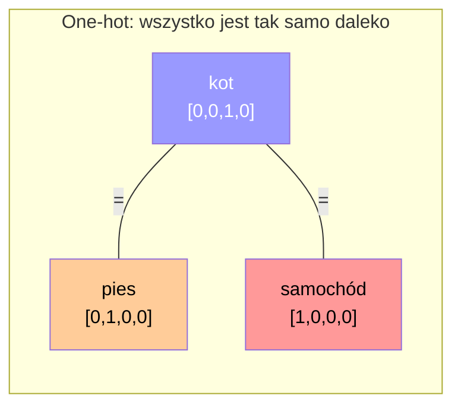

### Word2Vec: "Pokaż mi twoich sąsiadów, a powiem ci, kim jesteś"

Word2Vec opiera się na genialnej intuicji lingwistycznej: **słowa, które występują w podobnym kontekście, mają podobne znaczenie.**

Jeśli widzisz: "___ biega po parku i goni gołębie", to co tam wpadnie? Pies? Kot? Raczej nie "samochód" ani "demokracja". Kontekst definiuje słowo.

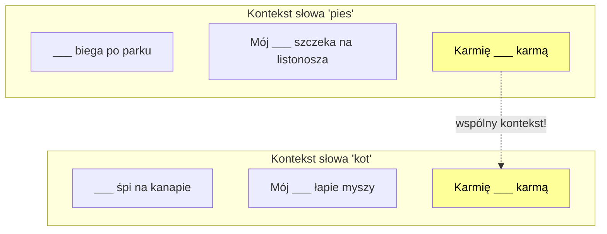

"Karmię ___ karmą" - zarówno pies, jak i kot pasują. To znaczy, że kontekst tych słów jest częściowo wspólny. I to jest właśnie to, co Word2Vec wykorzystuje.

Pamiętacie **Saussure'a** z [drugiego posta](semiotyka-a-llm.html)? Znaczenie jest relacyjne. "Kot" znaczy to, co znaczy, bo NIE jest "psem", NIE jest "domem". Word2Vec to matematyczna implementacja tej idei!

### CBOW i Skip-gram - dwie strony jednej monety

Word2Vec ma dwa warianty. Zobaczmy oba:

**CBOW (Continuous Bag of Words):** z kontekstu zgadujemy słowo środkowe.

``"Kot ___ na macie" → siedzi? leży? śpi?``

**Skip-gram:** ze słowa środkowego zgadujemy kontekst.

``"siedzi" → kot? na? macie?``

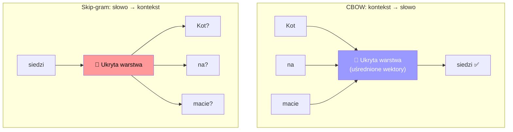

Jak to działa wewnątrz? Sieć neuronowa z jedną ukrytą warstwą:

1. Każde słowo zaczyna jako one-hot wektor (np. [0, 0, 1, 0, ...])
2. Mnożymy przez macierz wag **W** (rozmiar: słownik × wymiar embeddingu, np. 50 000 × 300)
3. Wynik to wektor o rozmiarze **E** (np. 300 liczb) - to jest nasz embedding!
4. W CBOW: uśredniamy wektory kontekstu i przewidujemy środek. W Skip-gram: bierzemy środek i przewidujemy sąsiadów.
5. Sieć trenuje się na milionach par (słowo, kontekst), aktualizując macierz **W**
6. Po treningu, **wiersz macierzy W odpowiadający danemu słowu to jego embedding**

Brzmi skomplikowanie? Zróbmy to w kodzie - od zera, bez żadnych bibliotek ML:

```python
import numpy as np

np.random.seed(42)

# --- 1. Słownik i one-hot encoding ---
corpus = "kot siedzi na macie i śpi pies siedzi na dywanie i śpi kot biega po pokoju pies biega po parku".split()
vocab = list(set(corpus))
word2idx = {w: i for i, w in enumerate(vocab)}
vocab_size = len(vocab)

def one_hot(word):
    vec = np.zeros(vocab_size)
    vec[word2idx[word]] = 1
    return vec

print(f'One-hot "kot": {one_hot("kot")}')
# [0. 0. 0. 0. 0. 0. 0. 0. 0. 0. 0. 1.]  - tylko jedna jedynka!

# --- 2. Macierz wag (to będą nasze embeddingi) ---
embed_dim = 5  # w prawdziwym Word2Vec to 100-300
W1 = np.random.randn(vocab_size, embed_dim) * 0.01  # słownik → embedding
W2 = np.random.randn(embed_dim, vocab_size) * 0.01  # embedding → słownik

# --- 3. Pary treningowe (CBOW: kontekst → środek) ---
window = 2
pairs = []
for i in range(window, len(corpus) - window):
    context = corpus[i - window:i] + corpus[i + 1:i + window + 1]
    target = corpus[i]
    pairs.append((context, target))

print(f'Kontekst: {pairs[0][0]} → Cel: {pairs[0][1]}')
# Kontekst: ['kot', 'siedzi', 'macie', 'i'] → Cel: na

# --- 4. Trening (gradient descent) ---
def softmax(x):
    e = np.exp(x - np.max(x))
    return e / e.sum()

for epoch in range(500):
    loss = 0
    for context_words, target_word in pairs:
        context_idx = [word2idx[w] for w in context_words]
        target_idx = word2idx[target_word]

        # forward: uśrednione embeddingi kontekstu → przewidujemy środek
        hidden = np.mean(W1[context_idx], axis=0)
        output = softmax(hidden @ W2)
        loss -= np.log(output[target_idx] + 1e-8)

        # backward: aktualizujemy wagi
        grad = output.copy()
        grad[target_idx] -= 1
        W2 -= 0.05 * np.outer(hidden, grad)
        grad_hidden = grad @ W2.T
        for idx in context_idx:
            W1[idx] -= 0.05 * grad_hidden / len(context_idx)

# --- 5. Wynik: embeddingi! ---
for word in ["kot", "pies", "siedzi", "biega"]:
    print(f"{word}: {W1[word2idx[word]].round(3)}")

# --- 6. Podobieństwo kosinusowe ---
def cosine(a, b):
    return np.dot(a, b) / (np.linalg.norm(a) * np.linalg.norm(b) + 1e-8)

print(f'kot ↔ pies: {cosine(W1[word2idx["kot"]], W1[word2idx["pies"]]):.3f}')
print(f'kot ↔ siedzi: {cosine(W1[word2idx["kot"]], W1[word2idx["siedzi"]]):.3f}')
print(f'kot ↔ biega: {cosine(W1[word2idx["kot"]], W1[word2idx["biega"]]):.3f}')
```

```
One-hot "kot": [0. 0. 0. 0. 0. 0. 0. 0. 0. 0. 0. 1.]
Kontekst: ['kot', 'siedzi', 'macie', 'i'] → Cel: na
kot: [-2.866 -0.264 -0.225 -1.822  2.783]
pies: [-1.133  0.678 -1.537  1.989  2.241]
siedzi: [ 1.524 -0.023  1.804 -2.355 -0.788]
biega: [ 2.     4.098 -0.315  2.971  0.815]
kot ↔ pies: 0.378
kot ↔ siedzi: -0.177
kot ↔ biega: -0.407
```

Zauważcie: **kot i pies** (0.378) są bardziej podobne niż **kot i biega** (-0.407). Sieć sama odkryła, że "kot" i "pies" to zwierzęta, bo występują w podobnym kontekście. Zero etykiet, zero nadzoru - tylko tekst i matematyka.

> [!NOTE]
> To jest **cały Word2Vec w ~30 linijkach**. Prawdziwy Word2Vec dodaje jeszcze negative sampling (bo softmax na 50 000 słów jest wolny) i optymalizacje, ale zasada jest dokładnie ta sama.

> [!NOTE]
> **"Fake task"**: Interesuje nas nie to, co sieć przewiduje, ale **wagi ukrytej warstwy**. Sieć trenujemy na "sztucznym" zadaniu przewidywania kontekstu, ale to, co chcemy wyciągnąć, to macierz W - nasze embeddingi. To trochę jak trenowanie kogoś do rozwiązywania krzyżówek nie po to, żeby dobrze rozwiązywał krzyżówki, ale po to, żeby poszerzył słownik ;-)

### CBOW vs Skip-gram

| | CBOW | Skip-gram |
|---|---|---|
| **Kierunek** | Kontekst → Słowo środkowe | Słowo środkowe → Kontekst |
| **Szybkość** | Szybszy | Wolniejszy |
| **Rzadkie słowa** | Radzi sobie gorzej | Radzi sobie lepiej |
| **Częste słowa** | Radzi sobie lepiej | Radzi sobie gorzej |
| **Kiedy użyć** | Duży korpus, częste słowa | Mały korpus, rzadkie słowa |

Według oryginalnej pracy Mikolova et al.: **Skip-gram jest lepszy dla rzadkich słów i małych zbiorów danych. CBOW jest szybszy i lepszy dla częstych słów.**

### Magiczna przestrzeń wektorowa

Po wytrenowaniu Word2Vec, każde słowo to wektor (np. 300 liczb). I ta przestrzeń ma niezwykłe właściwości:

**Słowa podobne są blisko:**
```
odległość("kot", "pies") < odległość("kot", "samochód")
odległość("Polska", "Niemcy") < odległość("Polska", "banan")
```

**Analogie działają jak dodawanie i odejmowanie wektorów:**
```
wektor("król") - wektor("mężczyzna") + wektor("kobieta") ≈ wektor("królowa")
```

Dlaczego? Bo wektor "króla" koduje wiele wymiarów znaczeniowych - w jednym z nich jest informacja o "rodzaju" (mężczyzna/kobieta), w innym o "władzy" (monarchia). Odejmując "mężczyznę" i dodając "kobietę", zmieniamy wymiar rodzaju, zachowując pozostałe.

Inne przykłady analogii:
```
Polska - Warszawa + Berlin ≈ Niemcy
mały - mniejszy + duży ≈ większy
łódź - woda + powietrze ≈ samolot
```

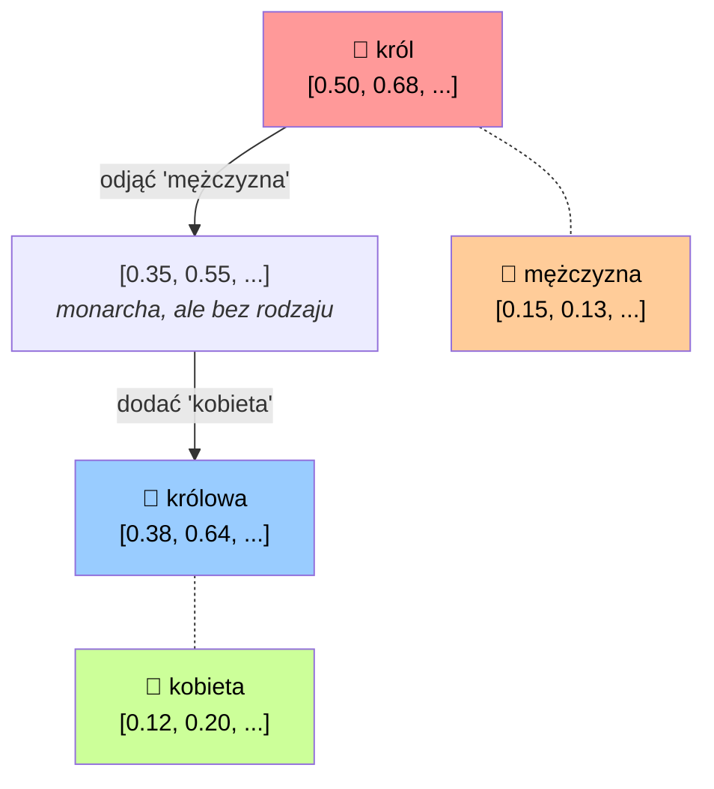

To jest to, o czym mówiliśmy w [pierwszym poście](cechy-jezykowe-a-llm.html) przy okazji semantyki. Teraz widzicie, **jak to działa pod spodem**.

### Word2Vec w kodzie

Najpierw wytrenujmy własny model na małym korpusie, żeby zobaczyć jak to działa od zera:

```python
from gensim.models import Word2Vec

corpus = [
    ["kot", "siedzi", "na", "macie", "i", "śpi"],
    ["pies", "siedzi", "na", "dywanie", "i", "śpi"],
    ["kot", "biega", "po", "pokoju"],
    ["pies", "biega", "po", "parku"],
    ["kot", "i", "pies", "bawią", "się", "w", "ogrodzie"],
    ["kot", "je", "karmę", "z", "miski"],
    ["pies", "je", "karmę", "z", "miski"],
    ["kot", "łapie", "mysz", "w", "domu"],
    ["pies", "goni", "kota", "po", "ogrodzie"],
    ["ptak", "siedzi", "na", "gałęzi", "drzewa"],
    ["ryba", "pływa", "w", "akwarium"],
    ["samochód", "jeździ", "po", "drodze"],
    ["rower", "jeździ", "po", "ścieżce"],
    ["kot", "mruczy", "gdy", "głaszczesz", "go"],
    ["pies", "merda", "ogonem", "gdy", "widzi", "pana"],
]

model = Word2Vec(
    sentences=corpus,
    vector_size=10,   # wymiar wektora (mały = edukacyjny)
    window=3,         # rozmiar okna kontekstowego
    min_count=1,      # ignoruj słowa rzadsze niż N
    sg=0,             # 0 = CBOW, 1 = Skip-gram
    epochs=200,       # ile przejść po danych
)

print(model.wv.most_similar("kot", topn=3))
# [('pies', 0.96), ('śpi', 0.95), ('na', 0.95)]

print(model.wv.similarity("kot", "pies"))       # ~0.96
print(model.wv.similarity("kot", "samochód"))   # ~0.83
```

> [!NOTE]
> Zauważcie: nasz korpus jest MALUTKI (15 zdań), więc wyniki są dalekie od idealnych — "kot" i "samochód" mają aż 0.83 podobieństwa, co jest bez sensu. Ale model poprawnie stawia "pies" najbliżej "kot"! Na prawdziwych korpusach (miliardy zdań) te wektory stają się bardzo dokładne.

A tak korzystamy z **gotowego modelu** wytrenowanego na miliardach słów:

```python
from gensim.downloader import load

model = load("glove-wiki-gigaword-50")

result = model.most_similar(
    positive=["king", "woman"],
    negative=["man"],
    topn=5
)

for word, score in result:
    print(f"{word}: {score:.3f}")

# queen: 0.852
# throne: 0.737
# ...
```

Możecie też sprawdzić podobieństwo między słowami:

```python
print(model.similarity("cat", "dog"))    # ~0.92
print(model.similarity("cat", "car"))    # ~0.15
```

"Cat" i "dog" - podobieństwo 0.92. "Cat" i "car" - 0.15. Model "wie", że kot jest bliżej psa niż samochodu.

> [!TIP]
> **Eksperyment:** Wejdźcie na [TensorFlow Embedding Projector](https://projector.tensorflow.org/) - to interaktywna wizualizacja przestrzeni wektorowej. Możecie wpisywać słowa i widzieć, co jest blisko. To jest JEDNA z najpiękniejszych wizualizacji w całym ML. Serio, sprawdźcie!

> [!WARNING]
> **Uwaga na uprzedzenia:** Word2Vec uczy się z danych. Jeśli w danych treningowych "programista" częściej występuje blisko "mężczyzna" niż "kobieta" - to model to wyłapie. Słynny przykład: `wektor("programista") - wektor("mężczyzna") + wektor("kobieta") ≈ "gospodyni domowa"`. To jest uprzedzenie ukryte w danych, które model bezrefleksyjnie reprodukuje. Pamiętacie semiosferę z [drugiego posta](semiotyka-a-llm.html)? Semiosfera nie jest neutralna - i dane treningowe też nie są.

### Od rzadkich wektorów do gęstych

Zróbmy jeszcze raz porównanie, żeby to sobie utrwalić:

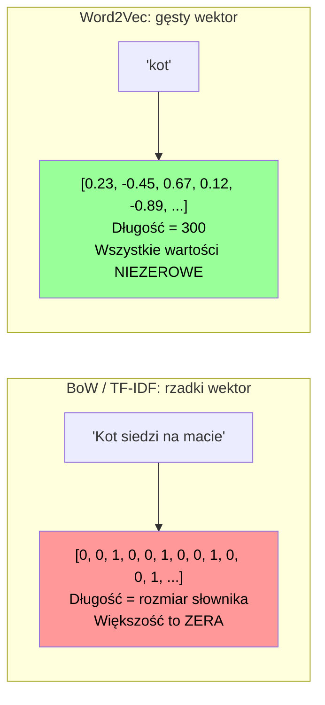

| | BoW / TF-IDF | Word2Vec |
|---|---|---|
| **Typ** | Rzadki (sparse) | Gęsty (dense) |
| **Długość wektora** | = rozmiar słownika (może być 100 000+) | = wymiar embeddingu (zwykle 100-300) |
| **Wartości** | Głównie zera | Wszystkie niezerowe |
| **Podobieństwo** | Trudno uchwycić | Kosinusowe podobieństwo działa super |
| **Kontekst** | Brak | Uchwycony przez okno kontekstowe |
| **Analogie** | Nie ma | Działają (król - mężczyzna + kobieta ≈ królowa) |

### Czy Word2Vec potrafi generować tekst?

Nie. Word2Vec tworzy **mapę znaczeń** — mówi ci, że "kot" jest blisko "pies", ale nie potrafi ułożyć z tego zdania. To jak słownik synonimów: wiesz co jest podobne, ale nie napiszesz wiersza.

Ale... co jeśli połączymy Word2Vec z łańcuchami Markowa? Łańcuch Markowa wybiera następne słowo na podstawie częstotliwości. A jeśli zamiast losować równie, sprawimy, że słowa bardziej podobne do kontekstu będą miały większą szansę?

```python
from gensim.models import Word2Vec
import numpy as np
from collections import defaultdict
import random

corpus = [
    "kot siedzi na macie i śpi",
    "pies siedzi na dywanie i śpi",
    "kot biega po pokoju",
    "pies biega po parku",
    "kot i pies bawią się w ogrodzie",
    "kot je karmę z miski",
    "pies je karmę z miski",
    "kot łapie mysz w domu",
    "pies goni kota po ogrodzie",
    "ptak siedzi na gałęzi drzewa",
    "kot patrzy przez okno i mruczy",
    "pies szczeka na listonosza",
    "kot śpi cały dzień na kanapie",
]

tokenized = [sentence.split() for sentence in corpus]

w2v_model = Word2Vec(sentences=tokenized, vector_size=10, window=3, min_count=1, epochs=200)

# budujemy macierz przejść (jak w łańcuchach Markowa)
transitions = defaultdict(list)
for sentence in tokenized:
    for i in range(len(sentence) - 1):
        transitions[sentence[i]].append(sentence[i + 1])

def generate(start, length=6):
    words = [start]
    for _ in range(length):
        current = words[-1]
        if current not in transitions:
            break

        candidates = transitions[current]

        # uśredniony wektor ostatnich słów = kontekst
        context_vector = np.mean(
            [w2v_model.wv[w] for w in words[-3:] if w in w2v_model.wv],
            axis=0,
        )

        # punktujemy kandydatów za podobieństwo do kontekstu
        scored = []
        for candidate in candidates:
            if candidate in w2v_model.wv:
                similarity = np.dot(context_vector, w2v_model.wv[candidate]) / (
                    np.linalg.norm(context_vector) * np.linalg.norm(w2v_model.wv[candidate]) + 1e-8
                )
                scored.append((candidate, similarity))

        if scored:
            # losujemy, ale z wagami — podobne słowa mają większą szansę
            weights = [score + 1 for _, score in scored]
            chosen = random.choices([w for w, _ in scored], weights=weights, k=1)[0]
            words.append(chosen)
        else:
            words.append(random.choice(candidates))
    return " ".join(words)

for _ in range(5):
    print(generate("kot"))
```

```
kot siedzi na macie i śpi
kot patrzy przez okno i mruczy
kot je karmę z miski
kot śpi cały dzień na kanapie
kot łapie mysz w domu
```

Nie jest to Szekspir, ale teksty są bardziej spójne niż czysty losowy Markow. Idea jest prosta:

1. Łańcuch Markowa daje **kandydatów** na następne słowo
2. Word2Vec **punktuje** kandydatów na podstawie podobieństwa do kontekstu
3. Wybieramy losowo, ale z **obciążeniem** — słowa bardziej pasujące mają większą szansę

To jest malutki krok w kierunku tego, co robią dzisiejsze LLM-y. One też przewidują następne słowo, ale zamiast prostej macierzy przejścia mają wielowarstwowe sieci Transformer z mechanizmem uwagi. Tam "punktowanie kandydatów" jest o wiele, wiele bardziej zaawansowane.

> [!IMPORTANT]
> **Kluczowa różnica:** Word2Vec daje każdemu słowu JEDEN wektor. Ale "zamek" w "zamek w drzwiach" i "zamek na wzgórzu" to zupełnie inne znaczenia! Word2Vec nie rozróżnia — dlatego w kolejnych wpisach wejdziemy w Transformer-y, gdzie **kontekst zmienia znaczenie** każdego słowa.

---

## Podsumowanie - cała droga w jednym miejscu

Oto nasza mapa drogowa, od cięcia tekstu do geometrii znaczeń:

| Metoda | Co robi | Kontekst? | Czego nie umie |
|---|---|---|---|
| **Tokenizacja (BPE)** | Tnie tekst na kawałki | Nie | Nie rozumie, co tnie |
| **BoW / TF-IDF** | Liczy słowa, waży rzadkością | Nie | Ignoruje kolejność |
| **N-gramy** | Patrzy na sekwencje słów | Lokalny (2-3 słowa) | Krótki kontekst, szybko rosnący słownik |
| **Naive Bayes** | Klasyfikuje na podstawie prawdopodobieństwa | Nie (słowa "niezależne") | Nie łapie zależności między słowami |
| **Word2Vec** | Zamienia słowa w wektory znaczeniowe | Tak (okno kontekstowe) | Jedno słowo = jeden wektor (ignoruje wieloznaczność) |

```mermaid
graph TD
    subgraph "Ewolucja: od liczenia do rozumienia"
        T["✂️ Tokenizacja<br/><i>tekst → kawałki</i>"] -->|"jak policzyć?"| B["🔢 BoW / TF-IDF<br/><i>kawałki → liczby</i>"]
        B -->|"brak kontekstu!"| N["🔗 N-gramy / Markow<br/><i>dodajemy kolejność</i>"]
        N -->|"chcemy klasyfikować!"| NB["📊 Naive Bayes<br/><i>prawdopodobieństwo klas</i>"]
        NB -->|"słowa to nie liczby!"| W["📐 Word2Vec<br/><i>geometria znaczeń</i>"]
        W -->|"co dalej?"| LLM["🤖 Transformers / LLM<br/><i>kontekst + attention + skala</i>"]
    end
    
    style T fill:#ff9999,color:#000
    style B fill:#ffcc99,color:#000
    style N fill:#ffff99,color:#000
    style NB fill:#ccff99,color:#000
    style W fill:#99ccff,color:#000
    style LLM fill:#9999ff,color:#fff
```

I kluczowa perspektywa: **z każdej z tych metod LLM wziął coś dla siebie.**

- **Tokenizacja (BPE)** to pierwszy krok pipeline'u każdego LLM. ChatGPT tnie wasz tekst na tokeny ZANIM cokolwiek z nim zrobi.
- **TF-IDF i BoW** to fundamenty myślenia o tekście jako o liczbach. Bez tego pomysłu, że słowa można "policzyć", nie byłoby uczenia reprezentacji (representation learning).
- **N-gramy i łańcuchy Markowa** to pierwowzór przewidywania następnego tokena. To jest dokładnie to, co robi LLM - tylko że LLM ma kontekst na tysiące tokenów, nie na 2-3.
- **Naive Bayes** pokazał, że probabilistyczne podejście do tekstu działa zaskakująco dobrze. LLM też jest modelem probabilistycznym - przewiduje prawdopodobieństwo następnego tokena.
- **Word2Vec** to przodek tego, co dziś nazywamy "embedding layer" w Transformerach. GPT nie używa już Word2Vec jako osobnego kroku, ale jego warstwa embeddingowa realizuje tę samą ideę: token → wektor.

**LLM nie spadł z nieba. Stoi na barkach gigantów.**

> [!IMPORTANT]
> **Co w następnym wpisie?** Wejdziemy w to, co dzieje się, gdy te wszystkie pomysły połączymy z mechanizmem **uwagi (attention)** i sieciami **Transformer**. Bo od Word2Vec (2013) do "Attention Is All You Need" (2017) do ChatGPT (2022) jest "tylko" kilkanaście lat i kilka przełomowych pomysłów ;-)

---

Wiem, że tego posta jest dużo, ale chciałem, żeby ta droga od "tnięcia tekstu" do "wektorów znaczeń" była pełna i zrozumiała.

Mam nadzieję, że chociaż kilka razy powiecie "aha!". Jeśli coś jest niejasne - **napiszcie w komentarzach**, postaram się wyjaśnić. A jeśli macie lepsze przykłady analogii Word2Vec - tym bardziej dajcie znać.

Która metoda was najbardziej zaskoczyła? Czy wiedzieliście, że ChatGPT "myśli" w tokenach, nie w słowach? I że jego "myślenie" to tak naprawdę potomek łańcuchów Markowa?

Do następnego!

---

**Źródła i ciekawe linki:**

Jeśli chcecie wejść głębiej, oto materiały, z których korzystałem:

- [Byte-Pair Encoding tokenization — Hugging Face](https://huggingface.co/learn/llm-course/chapter6/5) - świetne, krokowe wprowadzenie do BPE z kodem
- [Tokenization algorithms — Hugging Face](https://huggingface.co/docs/transformers/en/tokenizer_summary) - przegląd BPE, WordPiece, Unigram, SentencePiece
- [BPE Tokenizer From Scratch — Sebastian Raschka](https://sebastianraschka.com/blog/2025/bpe-from-scratch.html) - implementacja BPE od zera w Python, bardzo edukacyjna
- [Introduction to TF-IDF Vectorization in NLP — CodeSignal](https://codesignal.com/learn/courses/foundations-of-nlp-data-processing-2/lessons/introduction-to-tf-idf-vectorization-in-nlp) - czytelne wprowadzenie do TF-IDF z przykładami
- [Python for NLP: Developing an Automatic Text Filler using N-grams — StackAbuse](https://stackabuse.com/python-for-nlp-developing-an-automatic-text-filler-using-n-grams/) - super artykuł o n-gramach z generatorem tekstu
- [Brief Introduction to N-gram and TF-IDF — Medium](https://medium.com/in-pursuit-of-artificial-intelligence/brief-introduction-to-n-gram-and-tf-idf-tokenization-e58d22555bab) - porównanie TF-IDF vs n-gramy z kodem
- [Word Embeddings: CBOW vs Skip-Gram — Baeldung](https://www.baeldung.com/cs/word-embeddings-cbow-vs-skip-gram) - klarowne porównanie obu architektur Word2Vec
- [NLP 101: Word2Vec — Skip-gram and CBOW — Medium](https://medium.com/data-science/nlp-101-word2vec-skip-gram-and-cbow-93512ee24314) - dobre obrazki i intuicja dla Word2Vec
- [TF-IDF Character N-grams versus Word Embedding-based Models — ACL Anthology](https://aclanthology.org/2020.aespen-1.6/) - kontrast między klasycznymi cechami a embeddingami
- [TensorFlow Embedding Projector](https://projector.tensorflow.org/) - interaktywna wizualizacja przestrzeni wektorowej (obowiązkowe!)

[^1]: Odpowiedzi do quizu tokenizacyjnego: 1) "klasa" → ["k", "las", "a"] (l+a→la, la+s→las, ale "k" nie pasuje do żadnego scalenia) 2) "lata" → ["lat", "a"] (l+a→la, la+t→lat) 3) "laska" → ["las", "k", "a"] (l+a→la, la+s→las, ale "las"+"k" nie ma w scaleniach, więc zostaje podzielone).
