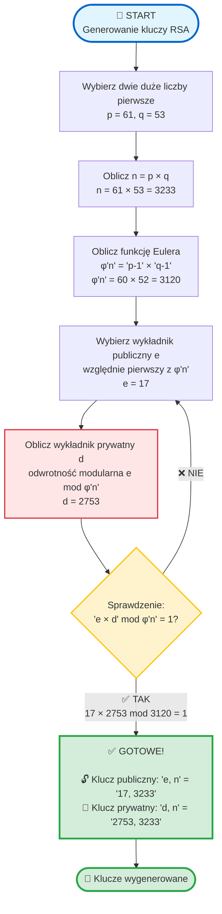
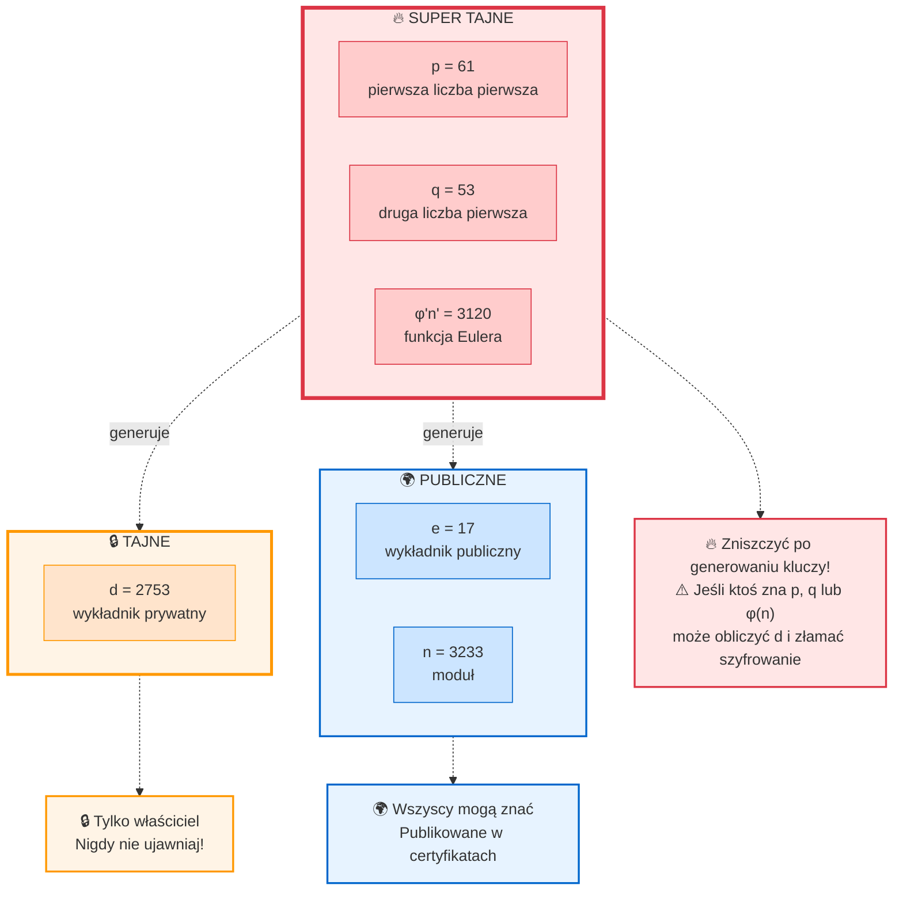
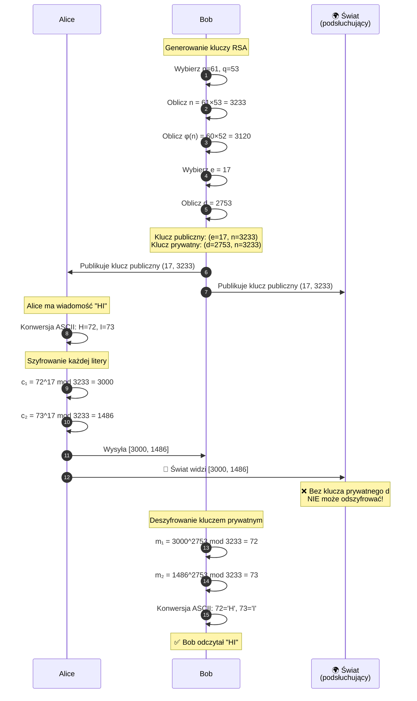
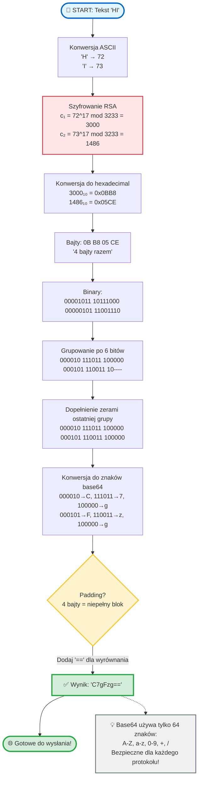

# RSA – czyli jak działa szyfrowanie asymetryczne bez czarnej magii

Parę tygodni temu ktoś mnie zapytał: *„Ej, a tak normalnie, po ludzku – jak działa RSA?”*.

No i pomyślałem: **OK, spróbuję to wytłumaczyć**, bo temat jest ważny, a często tłumaczony strasznie akademicko.

Wyobraźcie sobie, że chcecie wysłać komuś tajną wiadomość przez Internet. Wszyscy patrzą, wszyscy podsłuchują.  

Jak to zrobić, żeby **tylko odbiorca** mógł ją przeczytać? No właśnie tu wchodzi cały algorytm RSA, cały na biało ;)

---

## O co w ogóle chodzi z RSA?

RSA[^1] to **algorytm kryptografii asymetrycznej**. Brzmi groźnie, ale idea jest prosta:

- masz **dwa klucze**:
  - **publiczny** – możesz go dać całemu światu
  - **prywatny** – tego pilnujesz jak oka w głowie
- co zaszyfrujesz kluczem publicznym, **da się odszyfrować tylko prywatnym**

Można powiedzieć, że to taka kłódka, do której każdy ma klucz do zamykania, ale tylko ty masz klucz do otwierania ;)

---

## Skąd się biorą te klucze?

No dobra, tu zaczyna się matematyka, ale spokojnie – bez paniki.



### Krok 1: wybieramy dwie liczby pierwsze

**Ale czekaj – co to w ogóle jest liczba pierwsza?**

To liczba, która dzieli się **tylko przez 1 i przez samą siebie**.

Przykłady:
- **2, 3, 5, 7, 11, 13, 17, 19, 23...** – to liczby pierwsze ✓
- **4** (dzieli się przez 2), **6** (dzieli się przez 2 i 3), **8** (dzieli się przez 2 i 4) – to NIE są liczby pierwsze ✗

Liczby pierwsze to takie "atomy matematyki" – nie da się ich rozłożyć na mniejsze kawałki.

> [!NOTE] Dlaczego liczby pierwsze?
> Ta właściwość jest **fundamentem bezpieczeństwa RSA**! Liczby pierwsze są łatwe do pomnożenia, ale ich iloczyn jest praktycznie niemożliwy do rozłożenia z powrotem (dla dużych liczb).

**OK, do rzeczy:**

Na start wybierasz **dwie duże liczby pierwsze**:

```
p = 61
q = 53
```

(W praktyce to są liczby mające setki cyfr, ale na bloga wystarczy coś mniejszego).

### Krok 2: mnożymy je przez siebie

```
n = p * q = 3233
```

Ta liczba `n` będzie częścią **klucza publicznego**. I tak – każdy może ją znać.

---

## Magia (czyli funkcja Eulera)

Teraz liczymy tzw. **funkcję Eulera**:

```
φ(n) = (p - 1) * (q - 1)
φ(n) = 60 * 52 = 3120
```

### Co to w ogóle znaczy?

φ(n) (czytaj: "fi od en") mówi nam, **ile liczb jest względnie pierwszych z n**.

**Ale czekaj – co to znaczy "względnie pierwsze"?**

Dwie liczby są względnie pierwsze, gdy **nie mają wspólnych dzielników** (oprócz 1).
Czyli ich największy wspólny dzielnik (NWD) = 1.

**Przykłady:**
- 8 i 9 → względnie pierwsze (NWD=1), ale żadna nie jest liczbą pierwszą!
- 6 i 9 → NIE są względnie pierwsze (NWD=3)

**Mały przykład dla intuicji:**

Dla n=10 sprawdźmy każdą liczbę:
- 1 → NWD(1,10)=1 ✓
- 2 → NWD(2,10)=2 ✗ (dzieli się przez 2)
- 3 → NWD(3,10)=1 ✓
- 4 → NWD(4,10)=2 ✗
- 5 → NWD(5,10)=5 ✗
- 6 → NWD(6,10)=2 ✗
- 7 → NWD(7,10)=1 ✓
- 8 → NWD(8,10)=2 ✗
- 9 → NWD(9,10)=1 ✓

**Wynik:** liczby względnie pierwsze z 10 to {1,3,7,9}, czyli φ(10) = 4

### Dlaczego φ(n) = (p-1) × (q-1)?

To właśnie **piękno liczb pierwszych**!

Gdy n = p × q (gdzie p i q to liczby pierwsze), istnieje elegancki wzór:

Dla liczby pierwszej p, **wszystkie** liczby od 1 do p-1 są z nią względnie pierwsze.
Więc φ(p) = p-1.

Dzięki właściwościom mnożenia:
```
φ(p × q) = φ(p) × φ(q) = (p-1) × (q-1)
```

**W naszym przykładzie:**
- p = 61, więc φ(61) = 60
- q = 53, więc φ(53) = 52
- φ(3233) = 60 × 52 = 3120

### Dlaczego to jest TAKIE ważne dla RSA?

Funkcja φ(n) jest **kluczem do klucza prywatnego**!

- Znając p i q → łatwo obliczyć φ(n) → łatwo obliczyć klucz prywatny d
- Znając tylko n → musisz rozłożyć na czynniki → praktycznie niemożliwe dla dużych liczb

To właśnie ta „sekretna wiedza" o φ(n) pozwala nam stworzyć klucz prywatny, którego nikt inny nie może obliczyć!

---

## Wybór wykładnika publicznego (e)

Wybieramy liczbę `e`, która:
- jest względnie pierwsza z `φ(n)` (czyli NWD(e, φ(n)) = 1)
- zazwyczaj jest **mała** – to przyspiesza szyfrowanie!

### Dlaczego 65537 jest tak popularne?

W praktyce najczęściej używane wartości to:
- **3** – najszybsze szyfrowanie, ale może być podatne na niektóre ataki
- **17** – dobry kompromis
- **65537 (0x10001)** – **standard przemysłowy**

**Czemu akurat 65537?**

To liczba Fermata: F₄ = 2^16 + 1 = 65537

W zapisie binarnym:
```
65537 = 10000000000000001 (tylko dwie jedynki!)
```

To oznacza, że operacja `m^65537` to tylko:
- 16 operacji podniesienia do kwadratu
- 1 mnożenie

> [!TIP] Dlaczego 65537 to standard?
> Bardzo szybko się liczy (tylko dwie jedynki w zapisie binarnym), a jednocześnie jest wystarczająco duże żeby być bezpieczne. To idealny kompromis między wydajnością a bezpieczeństwem!

### Dla naszego przykładu:

```
e = 17
```

I teraz mamy:
- **klucz publiczny** = `(e, n)` → `(17, 3233)`

**Uwaga:** nie każde e będzie działać! Musi być względnie pierwsze z φ(n).
Jeśli spróbujesz użyć e, które ma wspólny dzielnik z φ(n), nie da się obliczyć klucza prywatnego d.

---

## Klucz prywatny – czyli to, czego nie wolno zgubić

Teraz najważniejsze: liczymy `d`, czyli **odwrotność modularną**:

```
d ≡ e⁻¹ (mod φ(n))
```

Czyli szukamy takiego `d`, żeby:

```
(d * e) % φ(n) = 1
```

### Co to właściwie znaczy?

Mówimy, że `d` jest odwrotnością modularną `e` względem φ(n), gdy ich iloczyn daje resztę 1 po podzieleniu przez φ(n).

**Przykład prostszy:** dla φ(n) = 10 i e = 3
- Szukamy d takiego, że (3 * d) mod 10 = 1
- Sprawdzamy: 3*1=3, 3*2=6, 3*3=9, 3*4=12, 3*5=15, 3*6=18, 3*7=21
- 21 mod 10 = 1 ✓ Więc d = 7

### Jak to obliczyć dla dużych liczb?

Dla małych liczb możemy próbować po kolei, ale dla liczb 1024-bitowych?
Użylibyśmy **rozszerzonego algorytmu Euklidesa** (Extended Euclidean Algorithm).

<details>
<summary>🔍 Jak działa rozszerzony algorytm Euklidesa?</summary>

Algorytm znajduje odwrotność modularną w czasie O(log n):

**Krok po kroku:**
1. Szukamy liczb x, y takich że: `e·x + φ(n)·y = NWD(e, φ(n))`
2. Jeśli NWD = 1, to x jest odwrotnością modularną
3. Normalizujemy: `d = x mod φ(n)`

**Przykład dla e=17, φ(n)=3120:**
```
3120 = 17 × 183 + 9
17 = 9 × 1 + 8
9 = 8 × 1 + 1    <- NWD = 1 ✓
8 = 1 × 8 + 0

Wsteczna substytucja:
1 = 9 - 8
1 = 9 - (17 - 9) = 2×9 - 17
1 = 2×(3120 - 183×17) - 17
1 = 2×3120 - 367×17

Więc: 17 × (-367) ≡ 1 (mod 3120)
d = -367 mod 3120 = 2753 ✓
```

To skomplikowane, ale na szczęście biblioteki robią to za nas!
</details>

Na szczęście w Pythonie to proste:
```python
d = pow(e, -1, phi)  # od Pythona 3.8
```

**W naszym przypadku:**

```
e = 17
φ(n) = 3120
d = 2753

Sprawdzenie: (17 * 2753) % 3120 = 46801 % 3120 = 1 ✓
```

I voilà:
- **klucz prywatny** = `(d, n)` → `(2753, 3233)`

> [!IMPORTANT] Bezpieczeństwo klucza prywatnego
> Klucz prywatny `d` trzymasz **TYLKO dla siebie**.
> Jeśli ktoś go zdobędzie = game over, może odczytać wszystkie twoje wiadomości!



---

## Szyfrowanie – w końcu!

### Jak zaszyfrować tekst?

RSA szyfruje liczby, więc najpierw **konwertujemy tekst na liczby**.

Najprościej: używamy kodów ASCII!

```
'H' → 72
'E' → 69
'L' → 76
'L' → 76
'O' → 79
```

Potem każdą liczbę szyfrujemy osobno wzorem:

```
c = m^e mod n
```



**Przykład krok po kroku:**

Chcę zaszyfrować słowo **"HI"**:

```
1. 'H' → ASCII: 72
   c₁ = 72^17 mod 3233 = 3000

2. 'I' → ASCII: 73
   c₂ = 73^17 mod 3233 = 1486
```

Zaszyfrowana wiadomość: **[3000, 1486]**

Wysyłasz te liczby do odbiorcy. Każdy może je zobaczyć, ale **bez klucza prywatnego nie odszyfrują** ;-)

### Przykład z pojedynczą liczbą:

```
m = 123
c = 123^17 mod 3233 = 855
```

Proste? Proste! Ale **tylko** z kluczem prywatnym możesz to odwrócić.

---

## Deszyfrowanie

Odbiorca bierze swój klucz prywatny i liczy:

```
m = c^d mod n
```

Dla naszego przykładu z "HI":

```
1. c₁ = 3000
   m₁ = 3000^2753 mod 3233 = 72 → 'H'

2. c₂ = 1486
   m₂ = 1486^2753 mod 3233 = 73 → 'I'
```

Odzyskaliśmy tekst: **"HI"**

Magia? Nie. Matematyka :-)

---

## A jak to przesłać przez Internet? Base64 do akcji!

OK, mamy zaszyfrowaną wiadomość: **[3000, 1486]**

Ale jak to wysłać mailem, przez API, w JSON-ie? Te liczby mogą być **OGROMNE** (setki cyfr dla prawdziwego RSA).

### Problem:

```
Zaszyfrowana wiadomość dla 2048-bit RSA:
[18446744073709551615, 98765432109876543210987654321...]
```

To niewygodne i może sprawiać problemy przy transmisji.

### Rozwiązanie: Base64

**Base64** to sposób kodowania danych binarnych jako tekst (używając tylko 64 znaków: A-Z, a-z, 0-9, +, /).



**Proces krok po kroku:**

### Przykład dla "HI":

Mamy zaszyfrowaną wiadomość: **[3000, 1486]**

```
Krok 1: Konwertuj każdą liczbę na bajty (hexadecimal)
   3000 (decimal) = 0x0BB8 = [0B B8] (2 bajty)
   1486 (decimal) = 0x05CE = [05 CE] (2 bajty)

Krok 2: Połącz wszystkie bajty w jeden ciąg
   [0B B8 05 CE] (4 bajty razem)

Krok 3: Bajty → base64
   Bajty:    0B    B8    05    CE
   Binary:   00001011 10111000 00000101 11001110

   Grupujemy po 6 bitów (base64 używa 6-bitowych grup):
   000010 111011 100000 000101 110011 10

   Dopełniamy ostatnią grupę zerami:
   000010 111011 100000 000101 110011 100000

   Konwertujemy każdą 6-bitową grupę na znak base64:
   000010 → C
   111011 → 7
   100000 → g
   000101 → F
   110011 → z
   100000 → g

   Dodajemy padding (==) bo base64 pracuje w 3-bajtowych blokach:
   - 4 bajty = 3 bajty (pełny blok) + 1 bajt (niepełny)
   - 1 bajt → 2 znaki + '==' (padding do pełnego bloku)
   "C7gFzg=="
```

**Podsumowanie dla "HI":**

```
Oryginał:       "HI"
ASCII:          [72, 73]
Zaszyfrowane:   [3000, 1486]
Bajty (hex):    [0B B8 05 CE]
Base64:         "C7gFzg=="
```

Teraz możesz wysłać **"C7gFzg=="** przez e-mail, JSON, gdziekolwiek!

Odbiorca robi proces odwrotny:
```
"C7gFzg==" → [0B B8 05 CE] → [3000, 1486] → deszyfruj → [72, 73] → "HI"
```

### Dlaczego to ważne?

- **Kompaktowe** – krótszy zapis niż surowe liczby
- **Bezpieczne** – działa w każdym systemie (nie ma problemów z kodowaniem)
- **Uniwersalne** – standard używany wszędzie (certyfikaty PEM, JWT, itp.)

**W praktyce:** większość bibliotek kryptograficznych automatycznie używa base64 do przesyłania zaszyfrowanych danych.

---

## Dlaczego to jest bezpieczne?

Pierwsze pytanie dla ciebie:
**co byś musiał zrobić, żeby złamać RSA?**

Ano… rozłożyć `n` na czynniki pierwsze (`p` i `q`).
Dla małych liczb – luz.
Dla liczb 2048-bitowych? Powodzenia, serio ;-)

Całe bezpieczeństwo RSA opiera się na tym, że:

> **mnożyć jest łatwo, rozkładać – piekielnie trudno**

### Ale czekaj – skąd się biorą te duże liczby pierwsze?

To dobre pytanie! Nie możemy przecież wypisać wszystkich liczb pierwszych i wybrać dwie – dla 1024 bitów byłoby ich **astronomicznie dużo**.

**Rozwiązanie:** losowanie + test pierwszości

**Algorytm generowania liczby pierwszej:**
1. Wylosuj dużą liczbę nieparzystą (np. 1024-bitową)
2. Wykonaj test pierwszości (np. Miller-Rabin z 40 rundami)
3. Jeśli test przeszedł → mamy liczbę pierwszą ✓
4. Jeśli test nie przeszedł → dodaj 2 i testuj ponownie
5. Powtarzaj aż znajdziesz pierwszą

**Ile to trwa?**

Według twierdzenia o liczbach pierwszych, prawdopodobieństwo że losowa liczba ~n jest pierwsza to **≈ 1 / ln(n)**.
Dla liczb 1024-bitowych: średnio trzeba sprawdzić **~355 liczb** żeby trafić na pierwszą.

Na współczesnym komputerze? **Kilka sekund** do minuty.

#### Test Millera-Rabina

To najpopularniejszy test pierwszości w kryptografii:
- **probabilistyczny** – nie daje 100% pewności, ale możemy ją dowolnie zwiększać
- **szybki** – O(k log³ n), gdzie k to liczba rund
- po 40 rundach: prawdopodobieństwo błędu < 2⁻⁸⁰ (praktycznie pewność!)

W praktyce działa tak:
```
dla każdej rundy:
    wylosuj liczbę 'a'
    sprawdź matematyczne własności n
    jeśli test nie przejdzie → n NIE jest pierwsza

jeśli wszystkie testy przeszły → n jest prawdopodobnie pierwsza
```

<details>
<summary>🔍 Matematyka za testem Millera-Rabina</summary>

Test wykorzystuje **małe twierdzenie Fermata** i własności pierwiastków pierwotnych:

**Dla liczby pierwszej n:**
1. Zapisz: `n - 1 = 2^r × d` (gdzie d nieparzyste)
2. Wybierz losowe `a` z zakresu [2, n-2]
3. Oblicz: `x = a^d mod n`
4. Sprawdź:
   - Jeśli `x = 1` lub `x = n-1` → możliwe, że pierwsza
   - Powtórz `r-1` razy: `x = x² mod n`
   - Jeśli któreś `x = n-1` → możliwe, że pierwsza
   - W przeciwnym razie → **na pewno złożona**

**Przykład dla n=221:**
```
221 - 1 = 220 = 4 × 55 = 2² × 55
r=2, d=55

Losujemy a=174:
x = 174^55 mod 221 = 47
47 ≠ 1 i 47 ≠ 220

x = 47² mod 221 = 168
168 ≠ 220

Test nie przeszedł → 221 jest złożone! ✓
(Faktycznie: 221 = 13 × 17)
```

Kluczowa własność: liczba złożona ma **maksymalnie 25% szans** oszukania testu w jednej rundzie. Po 40 rundach szansa: (0.25)^40 ≈ 10⁻²⁴ – praktycznie niemożliwe!
</details>

### O czym trzeba pamiętać przy implementacji?

#### 1. Źródło losowości ma znaczenie!

Są dwa podejścia do generowania liczb losowych:

**Pseudolosowe generatory (np. Mersenne Twister):**
- szybkie
- **ale przewidywalne!** – jeśli ktoś zgadnie lub pozna seed, może odtworzyć twoje klucze
- ⚠️ **NIGDY w produkcji!**

**Kryptograficznie bezpieczne generatory:**
- używają entropii z systemu operacyjnego (`/dev/urandom`, sprzętowe RNG)
- **nieprzewidywalne** nawet znając poprzednie wartości
- nieco wolniejsze
- ✅ **jedyna opcja do prawdziwych kluczy**

> [!WARNING] Słaba losowość = katastrofa bezpieczeństwa
> W 2012 roku grupa badaczy znalazła **12 tysięcy** publicznych kluczy RSA w internecie, które dzieliły wspólne czynniki pierwsze. Dlaczego? Słaba losowość przy generowaniu!
> **Zawsze używaj kryptograficznie bezpiecznych generatorów losowych!**

#### 2. Padding jest krytyczny

Podstawowy RSA (o którym piszę) to tzw. **"textbook RSA"** – działa, ale ma problemy:

**Problem deterministyczny:**
```
encrypt("TAK") zawsze daje ten sam wynik
encrypt("NIE") zawsze daje ten sam wynik
```

Atakujący może zgadywać wiadomości i porównywać wyniki!

**Rozwiązanie:** OAEP (Optimal Asymmetric Encryption Padding)
- dodaje losowość do każdego szyfrowania
- ta sama wiadomość za każdym razem daje **inny** szyfrogram
- dodatkowo chroni przed innymi atakami

> [!WARNING] Nigdy nie używaj "textbook RSA" w produkcji!
> Podstawowy RSA bez paddingu jest **podatny na ataki**. Zawsze używaj OAEP lub innego sprawdzonego schematu paddingu. To nie jest opcjonalne – to wymóg bezpieczeństwa!

#### 3. Timing attacks – bo czas też gada

Operacja `m = c^d mod n` trwa różnie długo w zależności od bitów w `d`.

Atakujący mierząc **czas deszyfrowania** tysięcy wiadomości może **odtworzyć klucz prywatny**!

**Obrona:**
- operacje w stałym czasie (constant-time algorithms)
- blinding – losowe przekształcenie przed deszyfrowaniem

> [!WARNING] Nie implementuj kryptografii sam!
> Timing attacks to tylko jeden z wielu zagrożeń. **Używaj sprawdzonych bibliotek** kryptograficznych (OpenSSL, libsodium, itd.) zamiast pisać własne implementacje. Eksperci spędzili lata chroniąc te biblioteki przed atakami!

---

## Jak duże powinny być klucze w praktyce?

W naszym przykładzie używałem małych liczb (p=61, q=53), ale w rzeczywistości...

### Rozmiary kluczy i bezpieczeństwo

| Rozmiar klucza | Status | Szacowany czas złamania |
|----------------|--------|-------------------------|
| **512 bitów** | ❌ Niezabezpieczone | Złamane w 1999 (RSA-155) |
| **768 bitów** | ❌ Niezabezpieczone | Złamane w 2009 (RSA-768, 2000 CPU-lat)[^2] |
| **1024 bity** | ⚠️ Przestarzałe | Możliwe dla dużych organizacji |
| **2048 bitów** | ✅ **Minimum dzisiaj** | Bezpieczne do ~2030 |
| **3072 bity** | ✅ Zalecane | Długoterminowe bezpieczeństwo |
| **4096 bitów** | ✅ Bardzo bezpieczne | Paranoja level ;-) |

**Konkretnie:** dla 2048-bitowego klucza każda liczba pierwsza (p i q) ma **~1024 bity = ~309 cyfr dziesiętnych**.

Przykładowa taka liczba:
```
179769313486231590772930519078902473361797697894230657273430081157732675805
500963132708477322407536021120113879871393357658789768814416622492847430639
474124377767893424865485276302219601246094119453082952085005768838150682342
462881473913110540827237163350510684586298239947245938479716304835356329624
224137217
```

Rozłożenie takiej liczby na czynniki? Z obecną technologią: **niemożliwe** w rozsądnym czasie.

### A co z komputerami kwantowymi?

Tutaj sprawa się robi ciekawa...

Algorytm Shora (kwantowy) teoretycznie może **złamać RSA w czasie wielomianowym**.

**Dzisiaj:**
- komputery kwantowe są za słabe (mamy ~100 qubitów, potrzeba tysięcy stabilnych)
- RSA jest bezpieczne

**Za 10-20 lat?**
- możliwe że RSA stanie się podatne
- dlatego już teraz rozwija się **kryptografia post-kwantowa** (np. CRYSTALS-Kyber, Dilithium)

> [!CAUTION] Zagrożenie kwantowe
> Komputery kwantowe mogą złamać RSA w czasie wielomianowym (algorytm Shora). Choć dziś są za słabe, za 10-20 lat mogą stać się realnym zagrożeniem.
> **Przygotuj się:** NIST standaryzuje już algorytmy post-kwantowe[^3]. Dla długoterminowego bezpieczeństwa rozważ algorytmy odporne na komputery kwantowe (CRYSTALS-Kyber, Dilithium).

---

## Formaty kluczy – jak to wygląda w praktyce?

Klucze RSA możesz zapisać na różne sposoby:

### PEM (Privacy Enhanced Mail)

To najpopularniejszy format, wyglądający tak:
```
-----BEGIN RSA PUBLIC KEY-----
MIIBIjANBgkqhkiG9w0BAQEFAAOCAQ8AMIIBCgKCAQEAu1SU1LfVLPHCozMxH2Mo
4lgOEePzNm0tRgeLezV6ffAt0gunVTLw7onLRnrq0/IzW7yWR7QkrmBL7jTKEn5u
...
-----END RSA PUBLIC KEY-----
```

Format base64 + nagłówki. Uniwersalny, działa wszędzie.

### DER (Distinguished Encoding Rules)

Binarna wersja PEM – mniejsza, szybsza do parsowania, ale nieczytelna dla człowieka.

### JSON Web Key (JWK)

Dla aplikacji webowych:
```json
{
  "kty": "RSA",
  "n": "u1SU1LfVLPHCozMxH2Mo...",
  "e": "AQAB"
}
```

Łatwo używać w API, JavaScript, itd.

---

## Gdzie spotykasz RSA na co dzień?

Jeśli korzystasz z:
- **HTTPS** 🔒 – certyfikaty SSL/TLS używają RSA (albo nowszych ECDSA)
- **SSH** – `ssh-keygen` domyślnie generuje klucze RSA
- **podpisy cyfrowe** – pliki .exe na Windowsie, dokumenty PDF
- **e-mail** – PGP/GPG do szyfrowania maili
- **VPN** – tunele szyfrowane

…to tak, **RSA tam siedzi** i robi robotę.

### Ciekawostka: podpisy cyfrowe

RSA działa też w drugą stronę!

**Szyfrowanie:** klucz publiczny → szyfruj, klucz prywatny → deszyfruj
**Podpis cyfrowy:** klucz prywatny → podpisz, klucz publiczny → zweryfikuj

```
podpis = hash(wiadomość)^d mod n
weryfikacja = podpis^e mod n == hash(wiadomość)
```

Dzięki temu możesz udowodnić, że TO TY napisałeś daną wiadomość (bo tylko ty masz klucz prywatny).

---

## Przypisy

[^1]: RSA pochodzi od nazwisk trzech twórców: **R**on **R**ivest, **A**di **S**hamir i Leonard **A**dleman, którzy opublikowali algorytm w 1977 roku. Ciekawostka: brytyjski matematyk Clifford Cocks wynalazł podobny system kilka lat wcześniej (1973), ale jego praca była tajna!

[^2]: RSA-768 (232 cyfry dziesiętne) zostało złamane w 2009 roku przez międzynarodowy zespół badaczy. Projekt wymagał około 2000 lat czasu CPU na komputerach z tamtego okresu. To pokazuje, że rozmiar klucza ma **kluczowe** znaczenie dla bezpieczeństwa.

[^3]: W 2024 roku NIST (National Institute of Standards and Technology) opublikował pierwsze standardy kryptografii post-kwantowej: FIPS 203 (ML-KEM, wcześniej CRYSTALS-Kyber), FIPS 204 (ML-DSA, wcześniej CRYSTALS-Dilithium) i FIPS 205 (SLH-DSA, wcześniej SPHINCS+). To algorytmy odporne na ataki komputerów kwantowych.