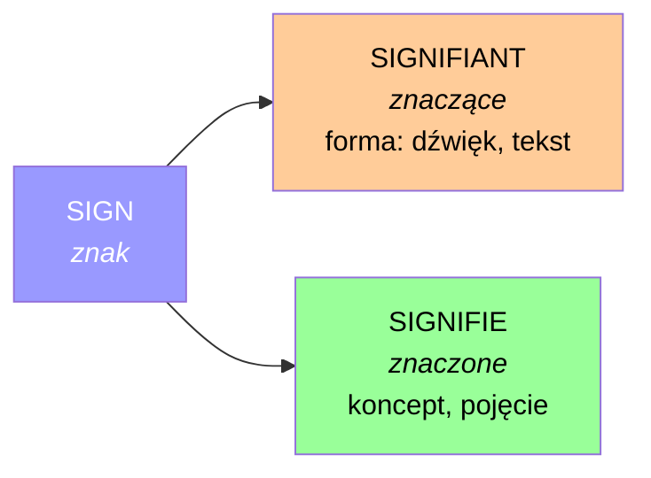
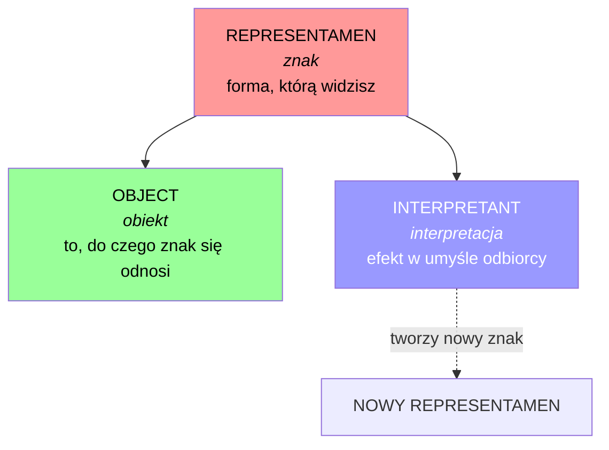
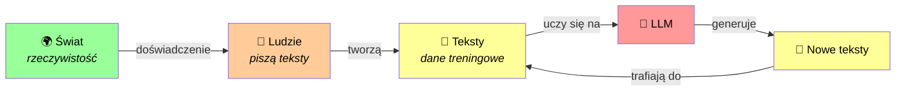
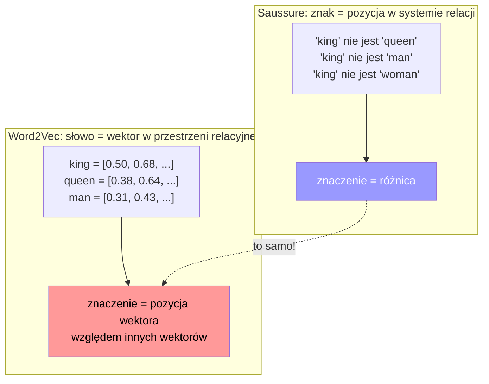
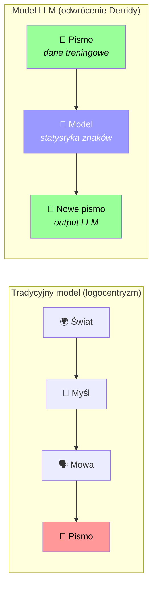
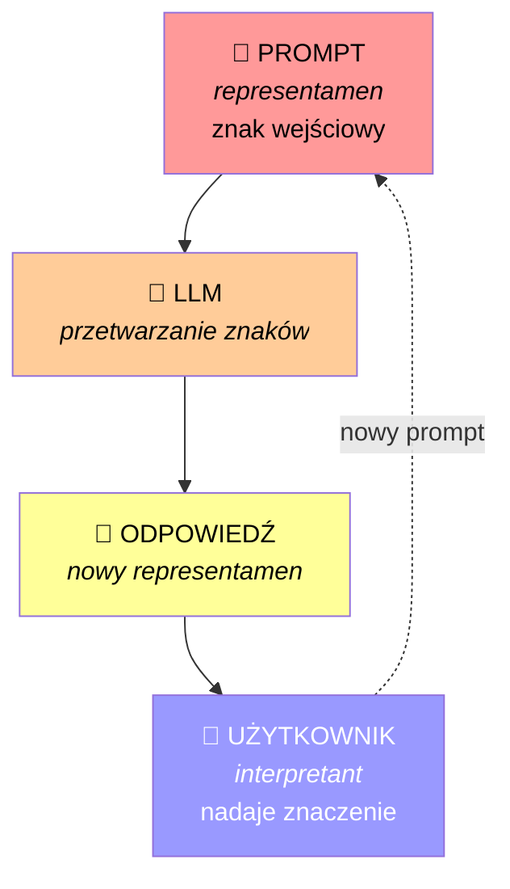
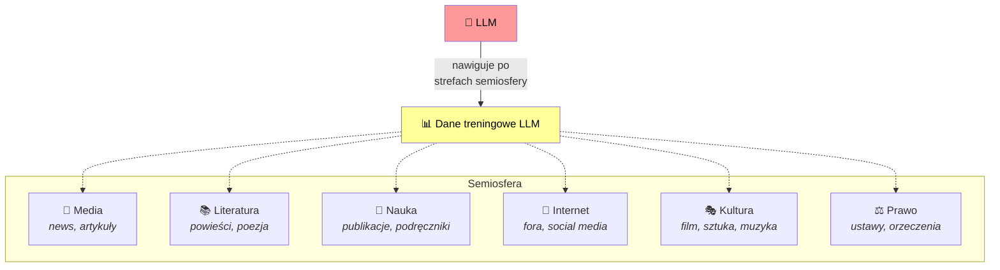
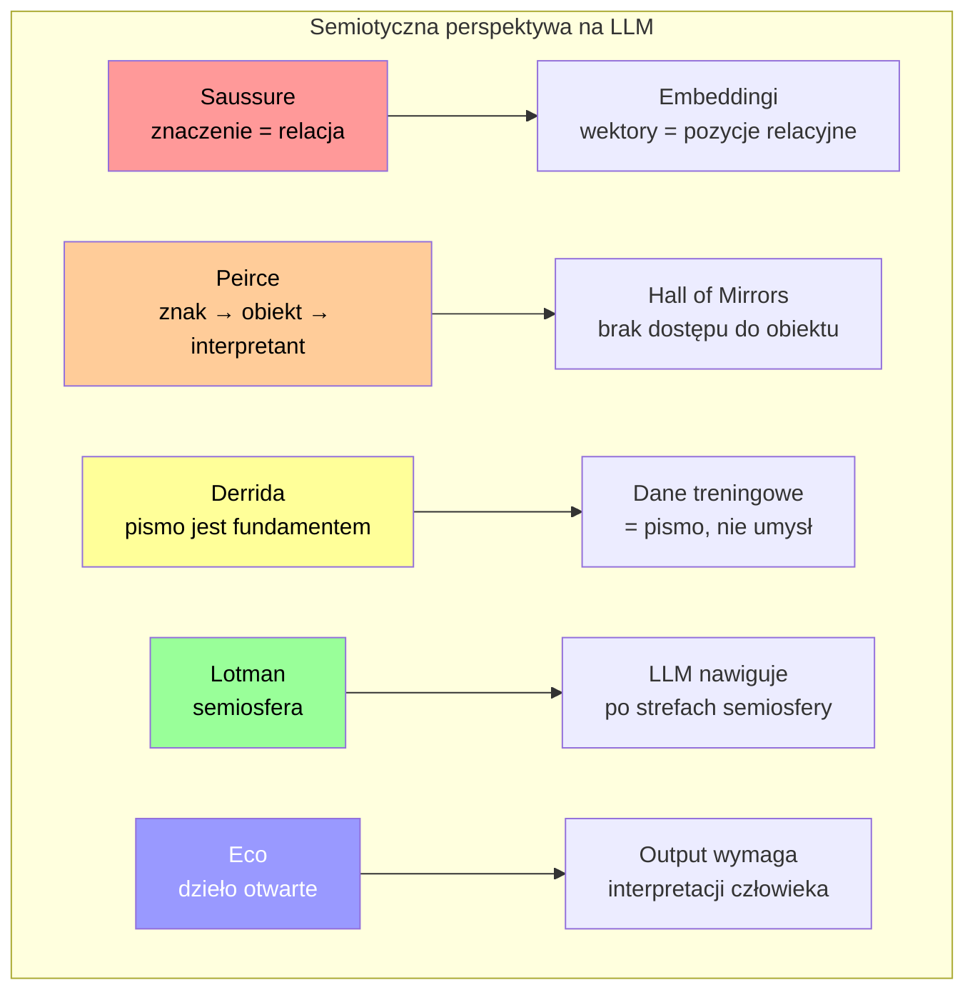

# Semiotyka - dlaczego LLM nie "myśli", ale jednak coś znaczy

W poprzednim wpisie zbudowaliśmy naszą językową cebulkę - pięć warstw, od fonetyki po pragmatykę, i zobaczyliśmy, jak LLM radzi sobie z każdą z nich. Ale po napisaniu tamtego posta zostało mi jedno wielkie "ale..." w głowie.

Bo przecież - **czy LLM w ogóle "rozumie" to, co generuje?** Czy ma jakiś wewnętrzny model świata? Czy myśli?

I wtedy wpadłem na semiotykę. I okazuje się, że semiotyka daje nam genialną ramę do myślenia o LLM - nie jako o sztucznym umyśle, ale jako o **maszynie znaków**. I nagle wszystko zaczyna mieć sens. Albo przynajmniej ma bardziej sens niż wcześniej ;-)

To jest **drugi wpis z serii "zrozumiec LLM"**. Dzisiaj zmieniamy perspektywę: zamiast patrzeć na *warstwy języka*, patrzymy na samą naturę tego, czym są **znaki** i jak **znaczenie** w ogóle powstaje. I dlaczego to jest kluczowe do zrozumienia, czym LLM jest - i czym nie jest.

---

## Czym jest semiotyka?

Zanim wejdziemy w LLM, musimy załatwić podstawy. Bo semiotyka to jedno z tych słów, które brzmi mądrze, ale co właściwie znaczy?

**Semiotyka** to nauka o znakach i o tym, jak znaki tworzą znaczenie. To wszystko. Nie brzmi już tak strasznie, prawda? ;-)

A "znak" w semiotyce to wszystko, co *coś oznacza*. Coś, co stoi za czymś innym. Proste przykłady:

- 🔴 Czerwone światło na skrzyżowaniu = **STOP**
- 😂 Emoji z łzami = **śmieję się** (albo: *umieram ze śmiechu*)
- 💨 Zapach dymu = **ogień gdzieś w pobliżu**
- 🐾 Ślady łap na śniegu = **tu przeszedł pies** (albo wilk, albo... better not think about it :D)

Każdy z tych znaków *reprezentuje coś innego*. I to "reprezentowanie" to jest właśnie to, co semiotyka bada.

> [!TIP]
> **Eksperyment:** Rozejrzyjcie się wokół siebie - ile znaków widzicie w tej chwili? Ja w tym momencie widzę: ikonę WiFi (mam internet), powiadomienie na telefonie (ktoś napisał), logo na kubku z kawą (marka). Trzy znaki i nawet nie wstałem z krzesła.

### Semiotyka vs semantyka

W poprzednim wpisie mieliśmy semantykę - badanie znaczenia słów i zdań. Więc czym semiotyka się różni?

Krótko:

| | Co pyta | Przykład |
|---|---|---|
| **Semantyka** | "Co to znaczy?" | Co znaczy słowo "zamek"? |
| **Semiotyka** | "Jak ten znak w ogóle działa?" | Jak to się dzieje, że czerwone światło OZNACZA "stop"? |

Semantyka pyta o konkretne znaczenia. Semiotyka pyta o **mechanizm znaczenia** - jak to się dzieje, że cokolwiek cokolwiek oznacza.

I właśnie dlatego semiotyka jest tak ważna dla zrozumienia LLM. Bo pytanie nie brzmi "co LLM znaczy", ale "**jak LLM operuje na znakach**".

---

## Dwóch gigantów: Saussure vs Peirce

W semiotyce są dwie główne tradycje, które musicie znać. Dwa podejścia, dwa sposoby myślenia o znakach. I uwaga - oba są ważne dla zrozumienia LLM, ale każdy z innej strony.

### Ferdinand de Saussure: znak jako para

Saussure (szwajcarski lingwista, żył na przełomie XIX i XX wieku) powiedział: **znak składa się z dwóch części**.



- **Znaczące** (signifiant) - forma znaku. To, co widzisz, słyszysz, dotykasz. Np. ciąg liter "k-o-t" albo dźwięk /kot/.
- **Znaczone** (signifié) - koncept, pojęcie, które ta forma wywołuje w twojej głowie. Np. futrzasty zwierzak, który miauczy i ignoruje cię przez większość dnia :D

I kluczowa rzecz: **relacja między znaczącym a znaczonym jest arbitralna**. Nie ma żadnego logicznego powodu, dla którego ciąg liter "k-o-t" oznacza właśnie tego zwierzaka. Po prostu... tak się przyjęło. W angielskim to "cat", w niemieckim "Katze", w japońskim "猫" (neko) - każdy język ma inny ciąg dźwięków/liter na to samo pojęcie.

Ale Saussure mówi coś jeszcze ważniejszego: **znaczenie słowa wynika z jego relacji do innych słów w systemie**. "Kot" znaczy to, co znaczy, bo NIE jest "psem", NIE jest "domem", NIE jest "samochodem". Znaczenie jest **różnicowe** - wynika z różnicy.

> To brzmi abstrakcyjnie, ale za chwilę zobaczycie, że to jest **dokładnie** to, co robią embeddingi w LLM. Naprawdę ;-)

### Charles Sanders Peirce: znak jako proces

Peirce (amerykański filozof, trochę wcześniej niż Saussure, ale mniej więcej w tym samym czasie) miał inne podejście. Dla niego znak nie jest statyczną parą, ale **dynamicznym procesem**.



Triada Peirce'a:

- **Representamen** - sam znak, forma (odpowiednik "znaczącego" u Saussure'a)
- **Obiekt** - to, do czego znak się odnosi (rzecz w świecie, koncept)
- **Interpretant** - efekt, który znak wywołuje w umyśle odbiorcy. I uwaga: ten interpretant SAM staje się nowym znakiem, który znowu ma swój interpretant, i tak dalej... **nieskończony łańcuch interpretacji**.

I to jest kluczowa różnica: u Saussure'a znak jest statyczny (para), u Peirce'a - **dynamiczny, żywy, będący procesem**. Znaczenie nie jest "zawarte" w znaku - ono powstaje w procesie interpretacji.

### Trzy rodzaje znaków według Peirce'a

Peirce podzielił znaki na trzy kategorie, które są super intuicyjne:

| Typ | Opis | Przykłady |
|---|---|---|
| **Ikona** | Podobieństwo między znakiem a obiektem | Portret, mapa, emoji 😺 (wygląda trochę jak kot), ikona folderu na komputerze |
| **Indeks** | Związek przyczynowo-skutkowy lub fizyczny | Ślady stóp na piasku (ktoś tu przeszedł), dym (ogień), kaszel (choroba), termometr (temperatura) |
| **Symbol** | Konwencja, umowa społeczna | Słowo "kot", flaga państwowa, czerwone światło = stop, matematyczne "=" |

> [!NOTE]
> Słowo "symbol" w codziennym języku znaczy coś innego niż w semiotyce Peirce'a! W semiotyce symbol to znak oparty **wyłącznie na konwencji** - nie przypomina obiektu (jak ikona) i nie jest z nim fizycznie związany (jak indeks). Flaga Polski nie "przypomina" Polski i nie jest z nią fizycznie połączona - po prostu się umówiliśmy, że te kolory oznaczają to państwo.

Sprawdźcie się - jaki to typ znaku?[^1]

1. 🌡️ Termometr pokazujący 37°C
2. 📸 Zdjęcie twojego psa
3. 🟢 Zielone światło = "jedź"
4. 🐾 Ślady butów na śniegu
5. ♿ Ikona dostępności

---

## Hall of Mirrors - czyli LLM utknął w lustrach

David Manheim, badacz AI, użył pięknej metafory pochodzącej od semiotyki Peirce'a. Nazwał to **"Hall of Mirrors Problem"** - problemem hali luster.

Wyobraźcie sobie: jesteście w pokoju pełnym luster. Widzicie odbicia odbić odbić... i nigdzie nie ma okna na zewnątrz. Nie widzicie prawdziwego świata - widzicie tylko... więcej luster.

To jest dokładnie to, co robi LLM.



Spójrzmy na to przez pryzmat triady Peirce'a:

- **Representamen** (znak) - tekst, tokeny, słowa - ✅ LLM ma dostęp
- **Obiekt** (rzeczywistość) - świat, doświadczenie, fizyka - ❌ LLM nie ma dostępu
- **Interpretant** (interpretacja) - zrozumienie - ❓ LLM generuje coś, co *wygląda* jak interpretacja

LLM nigdy nie widział świata. Nigdy nie poczuł smaku truskawki, nie dotknął lodu, nie usłyszał śmiechu. Całą swoją "wiedzę" o świecie czerpie z tekstu - z tego, co **inni ludzie napisali** o świecie.

Więc kiedy LLM pisze "truskawki są słodkie" - on nie *wie*, że są słodkie. On wie, że w tekstach, na których był trenowany, słowo "truskawki" często występuje blisko słowa "słodkie". To jest różnica. I to jest właśnie **semiotyczna** różnica.

> [!WARNING]
> **Paradoks:** LLM potrafi napisać piękny opis zachodu słońca, choć nigdy nie widział słońca. Ale potrafi też napisać piękny opis zachodu słońca **na Marsie** - choć tam jeszcze nikt nie widział zachodu słońca. Skąd "wie"? Z tekstu science fiction. Czyli: znaki odnoszą się do znaków, które odnoszą się do znaków... hala luster ;-)

---

## Saussure w kodzie: embeddingi jako system znaków

OK, teraz to, co obiecałem - zobaczmy, jak teoria Saussure'a realizuje się w kodzie. Bo to jest **naprawdę** fascynujące.

Pamiętacie, co mówił Saussure? **Znaczenie słowa wynika z jego relacji do innych słów**. "Kot" znaczy to, co znaczy, bo nie jest "psem", nie jest "domem" itd. Znaczenie jest relacyjne.

A teraz pomyślcie o **word embeddings** (osadzeniach słów) - które poznaliśmy w poprzednim wpisie. Każde słowo jest reprezentowane jako wektor w wielowymiarowej przestrzeni. I słowa o podobnym znaczeniu są **blisko** siebie w tej przestrzeni.

To jest **dokładnie** relacyjna teoria znaku Saussure'a, tylko zaimplementowana w matematyce!

```python
from gensim.downloader import load

model = load("glove-wiki-gigaword-50")

king = model["king"]
queen = model["queen"]
man = model["man"]
woman = model["woman"]

result = king - man + woman

from gensim.models import KeyedVectors
similarities = model.cosine_similarities(result, [queen])
print(f"Podobieństwo do 'queen': {similarities[0]:.3f}")
```

Wypisze coś w stylu: `Podobieństwo do 'queen': 0.850`

Ale spójrzcie na to z perspektywy Saussure'a:



Zarówno Saussure, jak i Word2Vec mówią to samo: **znaczenie nie jest w samym znaku - jest w jego relacji do innych znaków**. Saussure wymyślił to jako teorię języka. Programiści Google wymyślili Word2Vec jako algorytm. I doszli do tego samego wniosku.

No... prawie. Bo jest jeden haczyk. Saussure zakładał, że za znaczącym (forma) stoi **znaczone** (koncept). W embeddingach mamy tylko pozycję w przestrzeni - mamy relacje, ale czy mamy "koncept"? Czy wektor `[0.50, 0.68, ...]` **jest** konceptem "króla"?

To jest właśnie to pytanie, które doprowadza nas do kolejnego semiotyka...

---

## Derrida: pismo jako fundament

Jacques Derrida (francuski filozof, lata 60. i 70. XX wieku) zrobił coś odważnego. Spojrzał na całego Saussure'a i powiedział: **"Chwila. A dlaczego uważacie, że mowa jest ważniejsza od pisma?"**

Saussure (i cała zachodnia tradycja filozoficzna) traktował mowę jako "pierwotną" - bliższą myśli, bliższą znaczeniu. Pismo było "pochodne" - tylko zapis mowy, "znak znaku". Derrida nazwał to **logocentryzmem** - przekonaniem, że na końcu łańcucha znaków jest jakaś "obecność", "myśl", "intencja", która nadaje znaczenie.

I Derrida odwrócił to do góry nogami: **pismo nie jest podrzędne wobec mowy. Pismo jest systemem samym w sobie.**

Dlaczego to jest ważne dla LLM? Bo Elad Vromen w swoim artykule "Language Models as Semiotic Machines" zauważył coś genialnego:

> LLM trenuje na **piśmie** (tekst). Tworzy model **pisma**. Generuje nowe **pismo**. Nigdzie w tym procesie nie ma "mowy", "umysłu" ani "intencji". Cała hierarchia Saussure'a - mowa > pismo - zostaje odwrócona. Pismo jest jedyną rzeczywistością, jaką LLM zna.



Więc kiedy pytamy "czy LLM rozumie język?" - zadajemy **złe pytanie**. To jak pytanie "czy książka rozumie to, co jest w niej zapisane?" Książka nie "rozumie" - ale **zawiera znaki**, które my - czytelnicy - interpretujemy. LLM jest czymś pośrednim: nie jest książką (bo generuje nowy tekst), ale nie jest też umysłem (bo nie ma dostępu do znaczeń poza tekstem).

> [!IMPORTANT]
> **Derrida w pigułce dla LLM:** LLM nie modeluje "umysłu" ani "świata". LLM modeluje **pismo** - system znaków, który ma własną logikę, własne reguły, własną spójność. I to pismo jest wystarczające, żeby generować tekst, który *dla nas* ma znaczenie. Ale to **my** nadajemy mu znaczenie - nie model.

To też wyjaśnia pewien fenomen, który pewnie zauważyliście: LLM czasami mówi rzeczy, które są **statystycznie poprawne, ale nonsensowne**. Bo w systemie pisma, w którym operuje model, te słowa dobrze pasują do siebie. Ale my - jako ludzie z dostępem do świata (obiektów w sensie Peirce'a) - widzimy, że to nie ma sensu. Model nie ma tego "zakotwiczenia" w rzeczywistości.

<details>
<summary>Dla chętnych: Derrida i iterowalność</summary>

Derrida w swoim słynnym eseju "Signature Event Context" mówił o **iterowalności** znaków - o tym, że znak może być powtórzony w nowym kontekście i nabierać nowego znaczenia. Słowo "dobry" może być komplementem, ironią albo frazą w "dobry wieczór" - kontekst zmienia wszystko.

I to jest właśnie to, co widzimy w LLM: ten sam prompt w innym kontekście daje inną odpowiedź. Model nie "rozumie" kontekstu - ale **statystycznie** wyłapuje wzorce kontekstowe z danych treningowych. Czyli: iterowalność znaków w czystej, matematycznej postaci.

</details>

---

## Prompt jako akt semiotyczny

Teraz wchodzimy na bardzo praktyczny grunt. Bo jeśli LLM jest maszyną znaków, to **prompt** - to, co do niego wpisujecie - jest **aktem semiotycznym**. Nie po prostu "komendą". Ale aktem, który tworzy ramę dla znaczenia.

### Triada Peirce'a w praktyce

Spójrzmy na interakcję z LLM przez pryzmat triady Peirce'a:



Czyli:

1. **Wy** tworzycie prompt (representamen)
2. **LLM** przetwarza znaki i generuje odpowiedź (nowy representamen)
3. **Wy** interpretujecie odpowiedź (stajecie się interpretantem)
4. Wasza interpretacja prowadzi do nowego promptu... i cykl się powtarza

Zauważcie: **znaczenie powstaje dopiero w kroku 3**. LLM generuje ciąg tokenów, ale to Wy nadajecie mu sens. To jest dokładnie to, o czym mówił Umberto Eco z koncepcją **"dzieła otwartego"** - tekst nie ma jednego, ustalonego znaczenia. Tekst jest "ramą", którą czytelnik wypełnia interpretacją.

### Eksperyment: jak prompt zmienia ramę semiotyczną

Spróbujcie sami. Odpalcie ChatGPT (albo Claude, Gemini - co macie) i wyślijcie te trzy prompty, każdy w **nowej rozmowie**:

1. `"Wyjaśnij, czym jest grawitacja."`
2. `"Wyjaśnij grawitację pięciolatkowi."`
3. `"Wyjaśnij grawitację w stylu sonetu Szekspira."`

Każdy prompt dotyczy tego samego tematu (grawitacja). Ale każdy **zmienia ramę semiotyczną** - zmienia ton, rejestr, gatunek, oczekiwaną formę odpowiedzi.

| Prompt | Zmienia się... | Rama semiotyczna |
|---|---|---|
| "Wyjaśnij grawitację" | - | Neutralna, encyklopedyczna |
| "...pięciolatkowi" | Odbiorca, prostota języka | Edukacyjna, dostosowana do wieku |
| "...w stylu Szekspira" | Gatunek, forma, styl | Literacka, artystyczna |

To jest dokładnie to, co Picca nazywa **"semiotyczną umową"** (semiotic contract). Kiedy tworzycie prompt, nie "prosicie o informację" - **ustanawiacie warunki, w jakich znaczenie będzie konstruowane**. Prosicie o grawitację w trybie Szekspira? Otrzymujecie hybrydę fizyki i poezji. To nie jest "prawdziwa" grawitacja ani "prawdziwy" Szekspir - to jest **semiotyczny kolaż**, nowa konfiguracja znaków.

> [!TIP]
> **Eksperyment bonusowy:** Spróbujcie: *"Wyjaśnij pojęcie entropii używając metafor z bajek."* Zobaczycie, jak LLM łączy dwie zupełnie różne strefy semiotyczne - fizykę i baśnie. To jest właśnie to, co semiotyka nazywa **translacją między kodami kulturowymi**.

---

## Semiosfera - ekologia znaków

Jeszcze jedno pojęcie, które warto znać. Jurij Lotman, rosyjski semiotyk, wymyślił koncept **semiosfery**.

Semiosfera to przestrzeń, w której żyją znaki. To ekologia znaczeń - sieć kodów kulturowych, gatunków, dyskursów, ideologii, które wchodzą ze sobą w interakcje. Podobnie jak biosfera to przestrzeń, w której żyją organizmy, semiosfera to przestrzeń, w której żyją znaki.



Dane treningowe LLM są niczym innym jak **gigantycznym przekrojem semiosfery**. Kiedy model czyta Wikipedię, twittera, książki, artykuły naukowe, kody źródłowe - przyswaja (statystycznie!) całą tę różnorodność kodów kulturowych.

I dlatego potrafi pisać w stylu Szekspira, tłumaczyć z niemieckiego, żartować jak komik i cytować przepisy prawa - bo wszystko to jest w semiosferze, a model "widział" próbki z każdej strefy.

Ale jest i druga strona medalu: model przyswaja też **uprzedzenia, stereotypy i dominujące narracje** zawarte w semiosferze. Bo semiosfera nie jest neutralna - to przestrzeń kulturowa z historią, z władzą, z ideologią. I LLM, operując na znakach z tej przestrzeni, reprodukuje je w swoich outputach.

> [!WARNING]
> **Dlaczego LLM czasem mówi głupoty?** Bo semiosfera jest pełna sprzeczności. Na jednej stronie internetu "ziemia jest okrągła", na innej "ziemia jest płaska". Model widzi oba znaki i nie ma dostępu do "obiektu" (rzeczywistej ziemi), żeby zdecydować, który znak jest prawdziwy. Operuje w hali luster - znaki odnoszą się do znaków, a nie do rzeczywistości.

---

## Quiz: Saussure czy Peirce?

Sprawdźcie, który semiotyk lepiej wyjaśnia te zjawiska LLM. Przypominam:

- **Saussure**: znak = para (znaczące + znaczone), znaczenie relacyjne, system statyczny
- **Peirce**: znak = triada (representamen + obiekt + interpretant), proces interpretacji, dynamika

Kto lepiej wyjaśnia, że...?[^2]

1. **LLM potrafi pisać wiersze, choć nigdy nie czuł poezji** - Saussure czy Peirce?
2. **Embedding "król" - "mężczyzna" + "kobieta" = "królowa"** - Saussure czy Peirce?
3. **Ten sam prompt daje różne odpowiedzi w zależności od kontekstu rozmowy** - Saussure czy Peirce?
4. **LLM nie ma dostępu do świata, tylko do tekstu** - Saussure czy Peirce?
5. **Znamy kogoś, kto zapytał ChatGPT o diagnozę medyczną i ją dostał** - Saussure czy Peirce?

---

## Podsumowanie - mapa semiotyczna LLM

Oto nasza semiotyczna mapa w pigułce:

| Semiotyk | Kluczowy koncept | Co to mówi o LLM |
|---|---|---|
| **Saussure** | Znaczenie = relacja między znakami | Embeddingi realizują relacyjną koncepcję znaku |
| **Peirce** | Triada znak-obiekt-interpretant | LLM nie ma dostępu do obiektu, tylko do znaków (hala luster) |
| **Derrida** | Pismo jako system sam w sobie | LLM modeluje pismo, nie umysł; dane treningowe = jedyne źródło |
| **Lotman** | Semiosfera - ekologia znaków | Dane treningowe to przekrój semiosfery; LLM nawiguje po strefach |
| **Eco** | Dzieło otwarte | Output LLM nie ma jednego znaczenia - wymaga Waszej interpretacji |



Więc: **LLM nie ma umysłu.** Ale to nie znaczy, że nie robi nic interesującego. LLM operuje na znakach - rekonfiguruje je, łączy strefy semiosfery, tworzy nowe konfiguracje znaków. I te nowe konfiguracje **dla nas - jako interpretatorów - mają znaczenie**.

To jest semiotyczna odpowiedź na pytanie "czy LLM rozumie?". LLM nie "rozumie" w ludzkim sensie. Ale generuje znaki, które wchodzą w naszą semiosferę i stają się częścią naszego procesu interpretacji. I ten proces jest prawdziwy, ważny i potężny.

---

Wiem, że semiotyka na początku brzmi jak coś z innej planety, ale mam nadzieję, że teraz widzicie, jak to się łączy z LLM.

Kórą koncepcję semiotyczną uważacie za najbardziej przydatną do zrozumienia LLM? Saussure i jego relacyjność? Peirce i jego hala luster? A może Derrida i jego "pismo"?

Bo szczerze mówiąc - ja się dopiero uczę tej perspektywy. Ale czuję, że to jest ten moment, gdzie lingwistyka, filozofia i programowanie spotykają się w jednym miejscu i tworzą coś naprawdę fascynującego.

> **Co w następnym wpisie?** Przechodzimy od teorii do praktyki: [Jak komputer czyta tekst - od liczenia słów do wektorów](jak-komputer-czyta-tekst.html). Zobaczymy jak tokenizacja, TF-IDF, łańcuchy Markowa i Word2Vec realizują w kodzie to, o czym mówili Saussure (znaczenie jest relacyjne!) i Derrida (pismo jest systemem samym w sobie!).

Do następnego!

---

**Źródła i ciekawe linki:**

Jeśli chcecie wejść głębiej, oto materiały, z których korzystałem:

- [Davide Picca, "Not Minds, but Signs: Reframing LLMs through Semiotics" - arXiv](https://arxiv.org/abs/2505.17080) - główna inspiracja tego wpisu; propozycja patrzenia na LLM jako maszyny semiotycznej
- [Elad Vromen, "Language Models as Semiotic Machines" - arXiv](https://arxiv.org/abs/2410.13065) - genialne połączenie Saussure'a, Derridy i embeddingów
- [David Manheim, "Language Models' Hall of Mirrors Problem" - PhilPapers](https://philpapers.org/rec/MANLMH-2) - źródło metafory "hali luster"
- ["Semiotic reflections and modelling" - arXiv](https://arxiv.org/pdf/2509.14250.pdf) - prompty jako zjawiska semiotyczne
- ["The meaning of prompts: a semiotic approach to human-LLM interaction" - Emerald](https://www.emerald.com/jd/article/doi/10.1108/JD-03-2026-0140/1367688/The-meaning-of-prompts-a-semiotic-approach-to) - prompty jako akty znaczeniotwórcze
- ["A Semiotic Perspective on Generative AI and LLMs" - TurtlesAI](https://www.turtlesai.it/it/pages-391/a_semiotic_perspective_on_generative_ai_and_llms) - przystępne wprowadzenie do semiotyki generatywnej AI
- ["The Semiotic Perspectives of Peirce and Saussure: A Brief Comparative Study" - ScienceDirect](https://www.sciencedirect.com/science/article/pii/S1877042814057139) - porównanie dwóch głównych tradycji semiotycznych
- [Carlos E. Perez, "Semantics vs Semiotics: How LLMs Should Be Understood" - LinkedIn](https://www.linkedin.com/posts/ceperez_the-difference-between-semantics-and-semiotics-activity-7358534695254388737-gebY) - krótki post o tym, dlaczego semiotyka > semantyka dla LLM

[^1]: Odpowiedzi: 1) indeks (przyczynowo-skutkowy - temperatura powoduje rozszerzenie cieczy), 2) ikona (podobieństwo do psa), 3) symbol (czysta konwencja), 4) indeks (fizyczny ślad kogoś, kto tu przeszedł), 5) ikona (podobieństwo do osoby na wózku).

[^2]: Moje odpowiedzi: 1) **Peirce** - model nie ma dostępu do obiektu (doświadczenia poezji), ale generuje representameny (tekst), które interpretujemy. 2) **Saussure** - to jest czysta relacyjność! Król jest definiowany przez to, czym nie jest. 3) **Peirce** - kontekst zmienia interpretację, a interpretant tworzy nowy znak. 4) **Peirce** - brak obiektu w triadzie. 5) **Peirce + Lotman** - model reprodukuje znaki z semiosfery medycznej bez dostępu do rzeczywistego obiektu (ciała pacjenta). Diagnoza jest znakiem bez zakotwiczenia.
